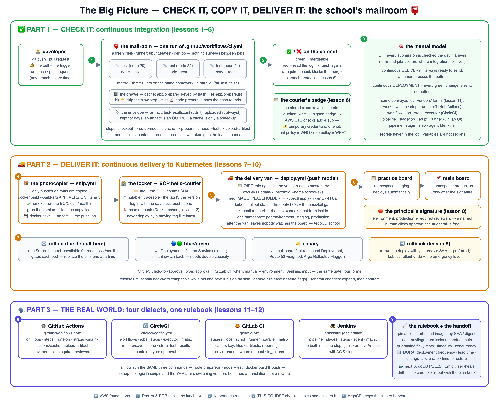

# 📮 Learn CI/CD the School Way

Course **3 of 4** in the school's Ops track — this one teaches **how tested code gets moved**:

0. 🪪 [learn-aws-school](https://github.com/BaluRaut/learn-aws-school) — the campus everything stands on (IAM, EC2, VPC…)
1. 🍱 [learn-docker-school](https://github.com/BaluRaut/learn-docker-school) — packs the lunchbox (images, ECR)
2. ☸️ [learn-kubernetes-school](https://github.com/BaluRaut/learn-kubernetes-school) — *runs* those images at scale
3. 📮 **learn-cicd-school** (this repo) — *checks, copies and delivers* them: CI, CD, four dialects
4. 🤖 [learn-argocd-school](https://github.com/BaluRaut/learn-argocd-school) — keeps clusters honest afterwards (GitOps)

🌐 **Interactive site:** **<https://baluraut.github.io/learn-cicd-school/>** — lesson cards,
every lesson as a numbered diagram, the [four-dialect page](https://baluraut.github.io/learn-cicd-school/pipelines.html)
(GitHub Actions · CircleCI · GitLab CI · Jenkins, side by side), and the one big-picture 4K diagram.

## 🗺️ The big picture — check it, copy it, deliver it



## 🎓 The 12 lessons

Each numbered branch adds ONE lesson folder (`lessons/NN-topic/README.md`) with an
explain-like-I'm-5 story, a school analogy, a diagram, **What / Why / How**, and hands-on
commands using this repo's real files — every pipeline snippet is quoted from the real
pipeline files, with the same step shown in all four dialects. Branches are **sequential** —
branch 07 contains lessons 01–07.

```bash
git checkout lesson-01-why-cicd          # read lessons/01-why-cicd/README.md, then...
git checkout lesson-02-pipeline-anatomy  # ...keep going, one branch at a time
```

### Part 1 — CHECK IT: continuous integration ✅

| # | Branch | You learn | Analogy |
|---|---|---|---|
| 01 | `lesson-01-why-cicd` | Integration hell; CI vs continuous delivery vs deployment | The homework pile-up vs the mailroom 📮 |
| 02 | `lesson-02-pipeline-anatomy` | Triggers, jobs, steps, runners; the four dialects' words | The conveyor belt 🧩 |
| 03 | `lesson-03-first-pipeline` | Fork, push, green check; make it red and fix it | The checking desk ✅ |
| 04 | `lesson-04-cache-parallel-matrix` | Cache keys, hits vs misses, parallel jobs, matrix | Sharpened pencils, three rulers ⚡ |
| 05 | `lesson-05-artifacts-reports` | Artifacts vs cache; JUnit reports; moving files between jobs | The envelope and the report card 📎 |
| 06 | `lesson-06-secrets-oidc` | Secrets, least privilege, OIDC to AWS with no stored keys | The courier's badge 🪪 |

### Part 2 — DELIVER IT: continuous delivery 🚚

| # | Branch | You learn | Analogy |
|---|---|---|---|
| 07 | `lesson-07-build-push-image` | Build, smoke-test and push the image tagged with the SHA | The photocopier 📦 |
| 08 | `lesson-08-environments-gates` | Staging → approval → production; branch protection | The principal's signature 🛑 |
| 09 | `lesson-09-deploy-strategies` | Rolling, blue/green, canary; rollback | Replacing the pins one at a time 🔁 |
| 10 | `lesson-10-deploy-to-kubernetes` | The push model: kubectl from CI, rollout status as the gate | The delivery van 🚚 |

### Part 3 — THE REAL WORLD 🗣️

| # | Branch | You learn | Analogy |
|---|---|---|---|
| 11 | `lesson-11-four-dialects` | GitHub Actions vs CircleCI vs GitLab CI vs Jenkins — one Rosetta table | Four courier companies 🗣️ |
| 12 | `lesson-12-pipeline-hygiene` | Flaky tests, pinning, least privilege, DORA metrics; handoff to GitOps | The rulebook and the graduation 🧹 |

## 📦 What's in this repo (main branch)

```
learn-cicd-school/
├── app/
│   ├── server.js                 # zero-dependency demo app (shows its hostname + version)
│   ├── server.test.js            # the tests the checking desk runs (node:test, Node 20+)
│   ├── prepare.js                # a deliberately slow step — makes cache hits vs misses visible
│   ├── package.json              # npm test / npm run test:ci (JUnit report)
│   └── Dockerfile                # the lunchbox recipe (APP_VERSION baked in by CI)
├── .github/workflows/
│   ├── ci.yml                    # ✅ test on every push: matrix, cache, JUnit artifact
│   ├── ship.yml                  # 📦 build → smoke-test → push to ECR (OIDC) → call deploy
│   └── deploy.yml                # 🚚 staging → approval gate → production on EKS
├── .circleci/config.yml          # 🔄 the same pipeline, CircleCI dialect
├── .gitlab-ci.yml                # 🦊 the same pipeline, GitLab CI dialect
├── Jenkinsfile                   # 🎩 the same pipeline, Jenkins declarative dialect
├── k8s/                          # Deployment (rolling update + readiness probe) and Service
├── iam/                          # WHO may wear the CI hat (OIDC trust) and WHAT it may do
└── docs/                         # the GitHub Pages site
```

**Fork it and it works.** The `ci.yml` workflow runs in your fork with no setup beyond
enabling Actions. The push and deploy jobs stay skipped until you add four repository
variables (`AWS_ROLE_ARN`, `AWS_REGION`, `ECR_REPOSITORY`, `EKS_CLUSTER`) — lesson 06 shows
the IAM side; the ECR repository and EKS cluster themselves come from the Docker and
Kubernetes schools.

⚠️ **Costs:** everything in Part 1 and the local labs in Parts 2–3 are free (a fork, Docker
Desktop or kind). Pushing to ECR and deploying to EKS use a real AWS account: ECR storage is
small, EKS is billed per hour while the cluster exists — create it for the lab and destroy it
the same day. CI vendors each have a free allowance that changes over time; check their current
pages.

## 🚀 Quickest possible taste (2 min, free)

```bash
gh repo fork BaluRaut/learn-cicd-school --clone && cd learn-cicd-school
cd app && node --test            # the checking desk, on your laptop
cd .. && git commit --allow-empty -m "wake the mailroom" && git push
gh run watch                     # ✅ the same tests, on three Node versions, in the cloud
```

## 🗣️ Four dialects, one pipeline

The four pipeline files describe the **same** conveyor. Read them side by side on the
[four-dialect page](https://baluraut.github.io/learn-cicd-school/pipelines.html), or
`diff` them yourself — notice that all four run the same three commands.

## 📜 License

MIT — see [LICENSE](LICENSE). Analogies are free to reuse; attribution appreciated.
