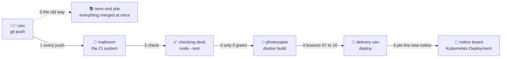

# 📮 Lesson 01 — Why CI/CD: the homework pile-up

**📍 You are here:** Lesson **01** of 12 · Next: `lesson-02-pipeline-anatomy`

---

## 📦 What's in this branch

The foundation of the course: **why a pipeline exists at all**, plus the tiny
app the courier will carry through all 12 lessons. Real files:

- [app/server.js](../../app/server.js) — the demo app (zero dependencies; answers on port **3000** with its hostname and version, `/healthz` says `ok`)
- [app/server.test.js](../../app/server.test.js) — three checks written with Node's built-in test runner; the checking desk runs exactly these on every push

## 🧒 Explain like I'm 5

Imagine a class where nobody hands in homework until the **last day of term**.
Thirty folders land on the teacher's desk at once. 📚 Pages are out of order,
two students numbered their sheets differently, one answer depends on a
worksheet someone else forgot to include. The teacher spends the whole
weekend just working out *whose pages fit together* — before grading a
single one. 😩

That weekend is **integration hell**. In software it looks like this: five
people work on their own branches for weeks, then merge on Friday, and the
result does not even build.

Now picture a different school. Every homework sheet goes into the
**mailroom** 📮 the day it is finished. A **courier robot** picks it up, runs
it past the **checking desk** ✅, and a stamp comes back within minutes:
✅ or ❌. Nothing piles up, because every sheet is checked while it is still
small and fresh — and when one fails, you know exactly which sheet and why.

That mailroom is your **CI system**. The robot's route — checking desk, then
the photocopier 🍱, then the delivery van 🚚 — is the **pipeline**. This
course is about building that route, one desk at a time.

## 🗺️ Diagram



## ❓ What

- **Continuous integration (CI)** = the habit of merging small changes into
  the shared main line frequently, with an automated build-and-test run on
  each one. The point is the *habit*; the tool is just the mailroom.
- **Continuous delivery** = the main line is kept **releasable at all times**;
  shipping to production is a decision a **human** makes by pressing a button
  (the principal's signature 🛑, lesson 08).
- **Continuous deployment** = every change that passes the pipeline goes to
  production **automatically**. No button. The pipeline *is* the signature.
- **Pipeline** = the ordered, automated route a change takes: check → copy →
  deliver. Each stop is a job; the whole route is the courier's round.
- **Integration hell** = what happens when merging is postponed: conflicts,
  a build nobody owns, and a weekend lost to archaeology.

### 🧠 The three words, side by side

```text
CI                      merge often, check each merge        → "it still works together"
Continuous delivery     main is releasable; a human ships    → the principal signs
Continuous deployment   every green change ships by itself   → no signature step
```

"CD" is used for both of the last two, which is why this course names the
one it means. Most teams practice delivery; deployment is delivery with
the signature step removed — a choice, not an upgrade.

## 🤔 Why

You already know how to pack the lunchbox (Docker school) and how to run it
(Kubernetes school). What is missing is the **trip in between**: from
`git push` to a pod running the new image, with a stamp at every stop. Do
that by hand and it happens rarely, late at night, by the one person who
remembers the steps. Do it with a pipeline and it happens on every push,
identically, with a log.

That is why this course sits at position 3️⃣ of the Ops track. It ends with
the delivery van pinning a notice on the board — the **push model** — and
with an honest list of what the van *cannot* do after it drives away
(drift, cluster credentials living in CI). That list is where the [ArgoCD
school's lesson 03](https://baluraut.github.io/learn-argocd-school/lesson-diagrams.html#l03)
picks up.

## 🔧 How (in this repo)

There is no pipeline in this lesson yet — only the homework and the answer
key. The app in [app/server.js](../../app/server.js) has one route the whole
track cares about, because the readiness probe (Kubernetes school lesson 07)
and the smoke test (lesson 07 here) both ask it:

```js
  if (req.url === '/healthz') {                 // "are you ready?" — the readiness probe asks this
    res.writeHead(200, { 'content-type': 'text/plain' });
    return res.end('ok\n');
  }
```

The checking desk's answer key is [app/server.test.js](../../app/server.test.js).
It starts the server on **port 0** (any free port, so tests do not collide
with a copy you left running) and asserts the exact body:

```js
test('GET /healthz answers ok — what the readiness probe asks', () =>
  withServer(async (base) => {
    const res = await fetch(`${base}/healthz`);
    assert.equal(res.status, 200);
    assert.equal(await res.text(), 'ok\n');
  }));
```

Both files use only `node:http`, `node:test` and `node:assert` — **zero
dependencies**. That is deliberate: no `npm install`, no lockfile, nothing to
download. When a run is slow or red in later lessons, it is the pipeline's
doing, not a package's. From [app/package.json](../../app/package.json),
the whole test command is `"test": "node --test"`.

## 🧪 Try it

```bash
# 0) you need Node 20 or newer (the tests use the built-in runner and fetch)
node --version

# 1) be the checking desk yourself
cd app
node --test                 # ✔ 3 tests, 3 pass — this exact command runs in CI from lesson 03 on

# 2) break the homework on purpose: make /healthz answer "okay" instead of "ok"
sed -i.bak "s/end('ok/end('okay/" server.js
node --test                 # ✖ GET /healthz answers ok … expected 'ok\n', actual 'okay\n'
echo "exit code: $?"        # non-zero — this is what turns a run red in lesson 03

# 3) fix it and confirm the stamp is green again
git checkout -- server.js && rm server.js.bak
node --test
cd ..
```

### ⚠️ Common mistakes

- calling "we have a Jenkins server" continuous integration — CI is merging small and often with a check on each merge; the server is just the mailroom
- treating delivery and deployment as synonyms — one keeps a human button, the other removes it, and that decides who gets paged at 2 a.m.
- keeping a branch alive for weeks and then "integrating" at the end — that is the term-end pile, no matter how green each branch's run was

## ⏭️ Next

Before the courier makes its first round, learn its parts: the bell that
starts it, the desks it visits, and the clerks who staff them. 🧩

```bash
git checkout lesson-02-pipeline-anatomy
```
