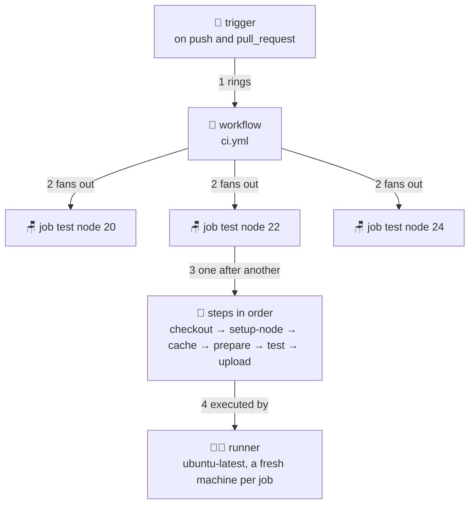

# 🧩 Lesson 02 — Anatomy of a pipeline: the bell, the desks, the clerks

**📍 You are here:** Lesson **02** of 12 · Previous: `lesson-01-why-cicd` · Next: `lesson-03-first-pipeline`

---

## 📦 What's in this branch

Lesson 01, **plus** the vocabulary you need to read any pipeline file — and
the first real one, read top to bottom without running it yet. Real files:

- [.github/workflows/ci.yml](../../.github/workflows/ci.yml) — the checking desk's route: one trigger, one job that fans out three ways, six steps (read only in this lesson)
- [.circleci/config.yml](../../.circleci/config.yml), [.gitlab-ci.yml](../../.gitlab-ci.yml), [Jenkinsfile](../../Jenkinsfile) — the same route in three other dialects; today you only borrow their words

## 🧒 Explain like I'm 5

Walk into the school mailroom 📮 and watch one round of the courier. A
**bell** rings 🔔 — a new envelope arrived. That is the **trigger**: a push,
a pull request, a timer, or someone pressing a button.

The bell starts a **route** with several **desks** 🪑. At each desk a clerk
does a short list of **tasks** in order: open the envelope, sharpen a pencil,
check the answers, stamp the sheet. The route is the **workflow**, each desk
a **job**, each task a **step**, and the clerk the **runner** — the machine
that actually does the work.

Desks are in *different rooms*, so anything that must travel between them
goes in an **envelope** 📎 (an artifact). A **drawer of sharpened pencils**
🗄️ saves time between rounds (a cache). Some desks need a **badge** 🪪 (a
secret). Notices end up on the **practice board** or the **main board** 📌
(environments), and the **principal's signature** 🛑 comes before the main
board (an approval). Four courier companies use this same mailroom — with
different words on their forms, which is the only hard part of today.

## 🗺️ Diagram



## ❓ What

- **Trigger / event** = what starts a run: a push, a pull request, a
  schedule, a manual button (`workflow_dispatch` in `ship.yml`).
- **Workflow** = one file, one route (`ci.yml`, `ship.yml`, `deploy.yml` here).
- **Job** = a unit of work on **its own fresh runner**. Jobs run in parallel
  unless one `needs:` another.
- **Step** = one command (`run:`) or one reusable action (`uses:`). Steps
  share the job's machine and run in order.
- **Runner** = the machine that executes a job, vendor-hosted or yours.
- **Artifact** 📎 = a file kept from a run for a human or a later job (lesson
  05). **Cache** 🗄️ = a speed-up keyed by a hash of its inputs (lesson 04).
  **Secret** 🪪 = a value stored encrypted, masked in logs (lesson 06).
  **Environment** 📌 = a named target such as `staging` with its own rules;
  **approval** 🛑 = a human gate in front of one (lesson 08).

### 🧠 Four dialects, one vocabulary

| 📮 in the mailroom | GitHub Actions | CircleCI | GitLab CI | Jenkins |
|---|---|---|---|---|
| the whole route | **workflow** | workflow | pipeline | pipeline |
| one desk (own machine) | **job** | job | stage + job | stage |
| one task at a desk | **step** | step | script line | step |
| the clerk (the machine) | **runner** | executor | runner | agent |

GitLab's **stages** run in sequence, their jobs side by side; Jenkins' `stage` is closer to a job.

## 🤔 Why

Every run page, error message and doc from here on uses these words, and a
mistake at the wrong level is expensive: a file written in step 3 exists in
step 4 but **not** in the next job, because that job is a different machine.
Say "job" for a machine and "step" for a command, and a whole class of
confusing failures in lessons 04–07 goes away. The words also travel to the
next mailroom, whatever its logo — see this course's [four-tab pipeline
page](https://baluraut.github.io/learn-cicd-school/pipelines.html) and the
[Docker school's lesson 12](https://baluraut.github.io/learn-docker-school/lesson-diagrams.html#l12).

## 🔧 How (in this repo)

Read [ci.yml](../../.github/workflows/ci.yml) from the top. First the
**name** and the **bell** — two events, no filters, so any branch rings it:

```yaml
name: ✅ ci

on:
  push:
  pull_request:
```

Two workflow-wide settings: `permissions:` shrinks the run's token (lesson
06); `concurrency:` lets a newer push cancel the older run (lesson 03):

```yaml
permissions:
  contents: read            # lesson 06: the job's own token gets the least it needs

concurrency:                # a newer push cancels the older run of the same branch
  group: ci-${{ github.ref }}
  cancel-in-progress: true
```

Then the **jobs**: one, `test`, that a **matrix** turns into three desks
(three rulers 📏, lesson 04), each on a fresh runner, each inside `app/`:

```yaml
jobs:
  test:
    name: test (node ${{ matrix.node }})
    runs-on: ubuntu-latest
    strategy:
      fail-fast: false      # lesson 04: let all three rulers finish, even if one fails
      matrix:
        node: [20, 22, 24]  # three rulers — the same homework checked three ways
    defaults:
      run:
        working-directory: app
```

Finally the **steps**, in order. `uses:` borrows a published action; `run:`
executes a shell command. The first two are both `uses:`:

```yaml
    steps:
      - name: 📥 checkout
        uses: actions/checkout@v4

      - name: 🟢 node ${{ matrix.node }}
        uses: actions/setup-node@v4
        with:
          node-version: ${{ matrix.node }}
```

Four more follow: the cache step (`id: cache`), the prepare step guarded by
`if: steps.cache.outputs.cache-hit != 'true'` (both lesson 04), the `🧪 test`
step (lesson 03 quotes it), and the upload step with `if: always()` (lesson 05).

**Two YAML gotchas** before you write your own:

1. **`on:` is a boolean in YAML 1.1.** GitHub reads it as the key `on`, but
   some linters and libraries (yamllint's *truthy* rule, PyYAML, Ruby's
   Psych) turn it into `true`. If a tool complains, write `"on":`.
2. **Indentation and quoting decide meaning.** The test step uses `run: >`,
   a *folded* block — three lines become **one** command; `run: |` would run
   three. Outputs are strings, so the real file compares `cache-hit` to
   `'true'`, not a bare `true`. A list item one space too far left ends the list.

## 🧪 Try it

```bash
# 0) fork and clone (you will need this fork from lesson 03 onward)
gh repo fork BaluRaut/learn-cicd-school --clone && cd learn-cicd-school

# 1) read the file and point at each part of the anatomy
cat .github/workflows/ci.yml
grep -nE '^(on|permissions|concurrency|jobs):|runs-on|matrix:|- name:|uses:|run:' .github/workflows/ci.yml
ruby -ryaml -e 'p YAML.load_file(".github/workflows/ci.yml").keys'   # optional, needs ruby: ["name", true, …] — the on: gotcha

# 2) ask GitHub which workflows the fork knows about (enable Actions once in the fork's Actions tab if empty)
gh workflow list
```

### ⚠️ Common mistakes

- saying "job" when you mean "step" — a job gets a fresh machine, a step shares one; files made in step 3 exist in step 4 but not in the next job
- indenting `steps:` under `runs-on:` (or a `- name:` one space off) — YAML accepts many wrong shapes silently and the error arrives from GitHub, not from your editor
- comparing an output to a bare `true` — step outputs are strings, so compare to `'true'` exactly as the real cache step does

## ⏭️ Next

Enough reading. Fork, push, and watch the checking desk stamp ✅ — then make
it stamp ❌ on purpose, so you know what red looks like before it matters.

```bash
git checkout lesson-03-first-pipeline
```
