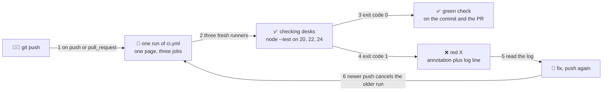

# ✅ Lesson 03 — Your first pipeline: green check on every push

**📍 You are here:** Lesson **03** of 12 · Previous: `lesson-02-pipeline-anatomy` · Next: `lesson-04-cache-parallel-matrix`

---

## 📦 What's in this branch

Lessons 01–02, **plus** the courier's first round in *your* fork: a push, a
run page, a green check — and a red one you cause on purpose. Real files:

- [.github/workflows/ci.yml](../../.github/workflows/ci.yml) — the `test` job that runs on each push and pull request; the `concurrency:` block that cancels stale runs
- [app/server.test.js](../../app/server.test.js) — the three checks that decide ✅ or ❌; break `/healthz` and the second one fails
- [.circleci/config.yml](../../.circleci/config.yml), [.gitlab-ci.yml](../../.gitlab-ci.yml), [Jenkinsfile](../../Jenkinsfile) — the same test job in the other three dialects

## 🧒 Explain like I'm 5

Today the mailroom opens for real. You drop a sheet in the slot 📮 (a
`git push`), the bell rings, and three clerks at three identical checking
desks ✅ run the same answer key over your homework — with a Node 20 ruler,
a 22, and a 24.

Each clerk ends with a stamp. **✅ green**: every check passed. **❌ red**:
one did not, and the clerk pins a short note saying which step gave up. The
stamp lands on your commit and, if the sheet is part of a **pull request**,
on the PR — right where a reviewer looks before merging.

One more rule: drop a second sheet before the first round is done and the
clerk abandons the old round for the new sheet — no point grading homework
you have already replaced. That is **concurrency** with `cancel-in-progress`.
And the best way to trust a stamp is to earn a red one on purpose. So we will.

## 🗺️ Diagram



## ❓ What

- **Run** = one execution of one workflow, started by one event: a URL, a
  status, and a page listing its jobs and steps.
- **Check** = the ✅ / ❌ / 🟡 badge on a commit or pull request. Each job
  reports one; the run is red if any job is.
- **Annotation** = a line GitHub lifts out of the log onto the run summary
  ("Process completed with exit code 1", or an `::error::` message). It says
  *where*; the log says *why*.
- **Pull-request check** = the same workflow run against the PR's proposed
  merge result. Branch protection can make it **required** (lesson 08).
- **Concurrency group** = a name; runs sharing it take turns. With
  `cancel-in-progress: true` the newer run cancels the older one.

### 🧠 The stamp is an exit code

```text
command exits 0         → step passes → job passes → run is green → commit / PR gets ✅
command exits non-zero  → step fails  → job fails  → run is red   → commit / PR gets ❌
```

By default that is the whole contract. CI does not "know" about tests — it
knows that `node --test` exits non-zero when one fails.

## 🤔 Why

A pipeline you have only read is a promise. One you have watched go green,
red, and green again is a tool: you know what a failure looks like, where
the message is, and how long the loop takes — *before* a Friday-evening
hotfix. That fast, visible feedback is the point of lesson 01's mailroom.
The same "test it before it travels" idea reappears when the [Docker
school's lesson 12](https://baluraut.github.io/learn-docker-school/lesson-diagrams.html#l12)
smoke-tests the built image in CI.

## 🔧 How (in this repo)

The bell in [ci.yml](../../.github/workflows/ci.yml) — `on: push:` and
`pull_request:`, quoted in lesson 02 — has no branch filter, so a push to
any branch of your fork rings it, and so does a pull request (a PR from a
branch *inside* the fork rings both — expect two runs per push). The step
that decides the stamp runs [server.test.js](../../app/server.test.js) and
exits non-zero on any failure:

```yaml
      - name: 🧪 test
        run: >
          node --test
          --test-reporter=spec  --test-reporter-destination=stdout
          --test-reporter=junit --test-reporter-destination=test-results.xml
```

**Reading the run page.** Actions tab → **✅ ci** → the list of runs. Open
one: a box per job — `test (node 20)`, `test (node 22)`, `test (node 24)` —
repeated in the left sidebar. Click a job for its steps; each expands to
its log. On a red run the failed step is marked and the summary carries the
annotation. **Re-run jobs** reruns the same commit; **Re-run failed jobs**
only the red ones.

**Stale runs cancel themselves:**

```yaml
concurrency:                # a newer push cancels the older run of the same branch
  group: ci-${{ github.ref }}
  cancel-in-progress: true
```

The group name includes the branch (`github.ref`), so only the older run of
*the same* branch is canceled; it shows gray, not red (GitHub's API spells
the status `cancelled`).

**The other workflow.** A push to `main` in your fork also rings
[ship.yml](../../.github/workflows/ship.yml): its `test` and `build` jobs
run, while `push` and `deploy` are guarded by `if: vars.AWS_ROLE_ARN != ''`
and show as **skipped** — by design; a fork has no AWS variables and stays
green anyway.

<details><summary>🔁 The same thing in CircleCI</summary>

```yaml
    docker:
      - image: cimg/node:<< parameters.node >>
    working_directory: ~/repo/app
    steps:
      - checkout:
          path: ~/repo
      # … restore_cache / prepare / save_cache: lesson 04
      - run:
          name: 🧪 test
          command: |
            mkdir -p test-results
            node --test --test-reporter=spec --test-reporter-destination=stdout \
                        --test-reporter=junit --test-reporter-destination=test-results/junit.xml
```

A Docker image is the executor, checkout is an explicit step; `workflows:` supplies `node`.
</details>

<details><summary>🦊 The same thing in GitLab CI</summary>

```yaml
test:
  stage: test
  image: node:${NODE}-alpine
  parallel:
    matrix:                                   # lesson 04: three rulers
      - NODE: ["20", "22", "24"]
  script:
    - cd app
    - node prepare.js                         # prints "already exists" on a cache hit
    - node --test --test-reporter=spec --test-reporter-destination=stdout
                  --test-reporter=junit --test-reporter-destination=test-results.xml
```

No checkout step — GitLab clones first. Each `script:` line is a step; a non-zero exit stops the job.
</details>

<details><summary>🎩 The same thing in Jenkins</summary>

```groovy
    stage('✅ test') {
      matrix {                                         // lesson 04: three rulers, in parallel
        axes { axis { name 'NODE'; values '20', '22', '24' } }
        agent { docker { image "node:${NODE}-alpine" } }
        stages {
          stage('test') {
            steps {
              dir('app') {
                // … prepare step: lesson 04
                sh '''node --test --test-reporter=spec  --test-reporter-destination=stdout \
                                  --test-reporter=junit --test-reporter-destination=test-results.xml'''
```

`agent { docker { … } }` is the clerk, `sh` the step; the stage follows the shell's exit code.
</details>

## 🧪 Try it

```bash
# 0) in your fork (lesson 02): enable Actions once in the Actions tab, then ring the bell
latest() { gh run list --workflow ci.yml --limit 1 --json databaseId --jq '.[0].databaseId'; }
git commit --allow-empty -m "ring the bell" && git push
gh run watch "$(latest)"             # three jobs → ✅ (a minute or two; a cold runner takes longer)

# 1) earn a red stamp on purpose: /healthz answers "okay" instead of "ok"
sed -i.bak "s/end('ok/end('okay/" app/server.js && rm app/server.js.bak
git commit -am "break /healthz on purpose" && git push
gh run watch "$(latest)"             # ❌ on all three rulers
gh run view "$(latest)" --log-failed | grep -A3 healthz   # expected 'ok\n', actual 'okay\n'

# 2) fix it (the good file is one commit back), then push twice quickly: the first run is canceled
git checkout HEAD~1 -- app/server.js && git commit -am "fix /healthz" && git push
git commit --allow-empty -m "and again" && git push
gh run list --workflow ci.yml --limit 3     # "fix /healthz" canceled, "and again" ✅

# 3) a pull-request check: same workflow, second bell (-R keeps the PR inside YOUR fork)
ME=$(gh api user --jq .login)
git checkout -b pr-check && git commit --allow-empty -m "try a PR" && git push -u origin pr-check
gh pr create -R "$ME/learn-cicd-school" --base main --head pr-check --fill
gh pr checks pr-check -R "$ME/learn-cicd-school" --watch    # the checks a reviewer sees
```

### ⚠️ Common mistakes

- pushing to a fresh fork and seeing nothing — workflows in a fork are disabled until you enable them once in the Actions tab
- reading only the red X — the annotation says "exit code 1"; the reason is a few lines above it in the test step's log (`gh run view --log-failed`)
- treating a gray **canceled** run as a failure — `cancel-in-progress` stopped the older run of the same branch on purpose; look at the newest run instead

## ⏭️ Next

On your very first run, three desks each ran `node prepare.js` from scratch.
Later runs did not. The mailroom keeps a drawer of sharpened pencils 🗄️ for
exactly that — if you tell it what the drawer is keyed by. ⚡

```bash
git checkout lesson-04-cache-parallel-matrix
```
