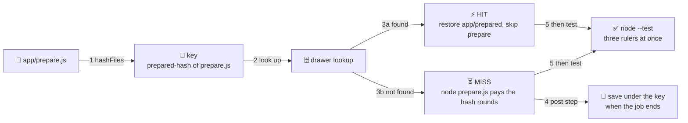

# ⚡ Lesson 04 — Fast pipelines: cache, parallel jobs, matrix

**📍 You are here:** Lesson **04** of 12 · Previous: `lesson-03-first-pipeline` · Next: `lesson-05-artifacts-reports`

---

## 📦 What's in this branch

Lessons 01–03, **plus** the three tools that keep the courier's round short:
a drawer keyed by its inputs, several desks at once, and one desk cloned
three ways. Real files:

- [.github/workflows/ci.yml](../../.github/workflows/ci.yml) — the `actions/cache@v4` step keyed by `hashFiles('app/prepare.js')`, the `if:` that skips the slow step on a hit, `strategy.matrix` with `fail-fast: false`
- [app/prepare.js](../../app/prepare.js) — a deliberately slow stand-in for `npm ci`; prints "already exists" when its output is present. Its output folder `app/prepared/` is in [.gitignore](../../.gitignore)
- [.circleci/config.yml](../../.circleci/config.yml), [.gitlab-ci.yml](../../.gitlab-ci.yml), [Jenkinsfile](../../Jenkinsfile) — the same drawer and rulers in the other dialects

## 🧒 Explain like I'm 5

Each round, the clerk at the checking desk used to sharpen a fresh box of
pencils before touching your homework. Same pencils, same sharpener. ✏️

So the mailroom added a **drawer** 🗄️. Its label is not "pencils" — it is
a fingerprint of the *sharpening instructions*. Same instructions → same
label → open the drawer, take the pencils, skip the sharpening: a **cache
hit** ⚡. New instructions → new label → no such drawer → sharpen, then file
the fresh pencils under the new label: a **cache miss** ⏳. If the janitor
empties the drawer overnight, nothing is lost — the next round sharpens
again. That is the whole difference from the envelope 📎 of lesson 05.

Two more speed tricks. **Several desks at once** 🪑🪑: jobs that do not
depend on each other run side by side. And **three rulers** 📏: the *same*
desk cloned three times, each measuring with a different Node version.
With `fail-fast` off, all three finish even if one measures wrong.

## 🗺️ Diagram



## ❓ What

- **Cache** = a saved copy of something a future run could rebuild, kept to
  save time. Per repository, may be evicted, must be safe to lose.
- **Cache key** = the label, built from a **hash of the inputs** that
  determine the contents: `prepared-${{ hashFiles('app/prepare.js') }}`.
  Change one byte of `prepare.js` → new hash → new key → miss.
- **Hit / miss** = the key exists / does not. On a hit the path is restored
  before your steps; on a miss it is saved when the job ends. **Restore
  keys** = fallback prefixes tried on a miss, newest first — right for
  `npm ci`, wrong for a step that trusts whatever it finds.
- **Parallel jobs** = *different* work at the same time; jobs without
  `needs:` run concurrently by default. **Matrix** = the *same* job repeated
  per parameter, each leg on its own runner. **`fail-fast: false`** lets the
  other legs finish when one fails.

### 🧠 Cache it, or not?

| | 🗄️ cache it | 🚫 do not cache it |
|---|---|---|
| does the key fully describe the contents? | yes — `prepared-<hash of app/prepare.js>` | no — outputs that also depend on files outside the hash |
| what losing it costs | time | correctness, or a missing deliverable |
| examples | `~/.npm`, `app/prepared`, Docker layers | secrets, whole-repo build output, files a later job *needs* (an artifact, lesson 05) |

## 🤔 Why

A slow pipeline gets ignored: people batch commits, skip the PR check, or
merge "while it's still running". Much of a typical run is not your tests
— it is preparing the same things again on a fresh machine. A cache with an
honest key removes that part; a matrix runs three checks in the time of
one; `fail-fast: false` turns "Node 24 broke" into a full report. The same
key-by-inputs rule drives Docker's layer cache — see the [Docker school's
lesson 02](https://baluraut.github.io/learn-docker-school/lesson-diagrams.html#l02).

## 🔧 How (in this repo)

**The drawer.** In [ci.yml](../../.github/workflows/ci.yml) the cache step
restores `app/prepared` if the key exists and, after a miss, saves it in a
post step once the job's last step has run:

```yaml
      - name: 🗄️ cache the slow preparation (lesson 04)
        id: cache
        uses: actions/cache@v4
        with:
          path: app/prepared
          key: prepared-${{ hashFiles('app/prepare.js') }}   # change prepare.js → new key → miss

      - name: ⏳ prepare (slow on a miss, skipped on a hit)
        if: steps.cache.outputs.cache-hit != 'true'
        run: node prepare.js
```

`id: cache` lets the next step read `cache-hit`. On a hit the slow step is
**skipped entirely**; on a miss it runs [prepare.js](../../app/prepare.js),
which is slow on purpose:

```js
const ROUNDS = Number(process.env.PREPARE_ROUNDS || 12_000_000);  // ~3 s on a laptop, ~8–10 s on a CI runner

if (fs.existsSync(OUT)) {
  console.log(`⚡ prepared/table.json already exists — nothing to do (this is what a cache hit feels like)`);
  process.exit(0);
}
```

Treat those timings as a rough guide — a hosted runner is usually slower
than a laptop and varies run to run; the *shape* is what matters. Note the
`existsSync` check: `prepare.js` trusts whatever is on disk, which is why
this cache has **no restore keys**. A `restore-keys: prepared-` fallback
(illustrative, not in `ci.yml`) would hand a near-miss a stale `table.json`
and `prepare.js` would say "already exists". Restore keys belong on steps
like `npm ci` that *finish* a partial result.

**Three rulers.** The matrix lives on the job; each leg is a full job on its
own runner, so the three run side by side:

```yaml
    strategy:
      fail-fast: false      # lesson 04: let all three rulers finish, even if one fails
      matrix:
        node: [20, 22, 24]  # three rulers — the same homework checked three ways
```

Without `fail-fast: false` (the default is `true`) the first red leg cancels
the other two; a *compatibility* matrix wants all three answers. Contrast
[ship.yml](../../.github/workflows/ship.yml), whose jobs are chained with
`needs:` — different work, deliberately **not** parallel.

**Docker layers** are the other big cache here: a fresh runner has none, so
`docker build` in lesson 07 rebuilds each layer unless you bring a cache
along (options exist; the Docker school's lesson 02 covers what a layer
cache can and cannot reuse).

<details><summary>🔁 The same thing in CircleCI</summary>

```yaml
      - restore_cache:                                        # lesson 04: the drawer
          keys:
            - prepared-v1-{{ checksum "prepare.js" }}
      - run:
          name: ⏳ prepare (skipped when restored from cache)
          command: node prepare.js
      - save_cache:
          key: prepared-v1-{{ checksum "prepare.js" }}
          paths: [prepared]
```

Restore and save are explicit steps; `prepare.js` runs each round and just
prints "already exists" on a hit. `v1-` is a manual reset switch; the matrix sits under `workflows:`.
</details>

<details><summary>🦊 The same thing in GitLab CI</summary>

```yaml
  parallel:
    matrix:                                   # lesson 04: three rulers
      - NODE: ["20", "22", "24"]
  cache:                                      # lesson 04: the drawer, keyed by the file that defines the work
    key:
      files: [app/prepare.js]
    paths: [app/prepared/]
```

`cache: key: files:` hashes the listed files for you (the `hashFiles` idea); restore and save are implicit around `script:`.
</details>

<details><summary>🎩 The same thing in Jenkins</summary>

```groovy
      matrix {                                         // lesson 04: three rulers, in parallel
        axes { axis { name 'NODE'; values '20', '22', '24' } }
        agent { docker { image "node:${NODE}-alpine" } }
```

```groovy
                // Jenkins has no built-in cache step: a persistent agent keeps the workspace
                // (so prepared/ survives between builds); ephemeral agents need the Job Cacher plugin.
                sh 'node prepare.js'
```

Honest note: the `matrix` directive is built in; a keyed cache is not.
</details>

## 🧪 Try it

```bash
# 0) feel a miss and a hit on your laptop
cd app
node prepare.js            # ⏳ preparing… ✅ wrote prepared/table.json in N s (a few seconds, laptop-dependent)
node prepare.js            # ⚡ already exists — nothing to do
git status --short         # empty: app/prepared/ is git-ignored, so the drawer stays out of commits
cd ..

# 1) in your fork: a whitespace change to prepare.js → new hash → new key → MISS
latest() { gh run list --workflow ci.yml --limit 1 --json databaseId --jq '.[0].databaseId'; }
echo "" >> app/prepare.js && git commit -am "touch prepare.js (new cache key)" && git push
gh run watch "$(latest)" && gh run view "$(latest)" --log | grep -E "Cache not found|preparing|Cache saved"

# 2) push again WITHOUT touching prepare.js → same key → HIT, prepare step skipped
git commit --allow-empty -m "same key, expect a hit" && git push
gh run watch "$(latest)" && gh run view "$(latest)" --log | grep -E "Cache restored"

# 3) see the drawers GitHub keeps for your fork
gh cache list
```

### ⚠️ Common mistakes

- keying the cache on something that does not describe its contents (a fixed string, the branch name) — you get yesterday's pencils indefinitely; hash the inputs instead
- adding `restore-keys` to a step that trusts whatever it finds, like `prepare.js`'s `existsSync` — a near-miss silently becomes a stale hit
- leaving `fail-fast` at its default for a compatibility matrix — the first red ruler cancels the other two and you learn about one version per push

## ⏭️ Next

The drawer is for things you could remake. Next: the things you *must not*
lose — the report card 📋 a human reads and the envelope 📎 the next desk
opens.

```bash
git checkout lesson-05-artifacts-reports
```
