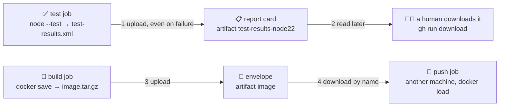

# 📎 Lesson 05 — Artifacts & test reports: what travels between desks

**📍 You are here:** Lesson **05** of 12 · Previous: `lesson-04-cache-parallel-matrix` · Next: `lesson-06-secrets-oidc`

---

## 📦 What's in this branch

Lessons 01–04, **plus** the two things a desk can hand to someone else: a
**test report** a human reads and an **artifact** a later job needs. Real files:

- [.github/workflows/ci.yml](../../.github/workflows/ci.yml) — the `📎 upload the report card` step: `if: always()`, `retention-days: 7`
- [.github/workflows/ship.yml](../../.github/workflows/ship.yml) — the `build` job saves `image.tar.gz`; the `push` job downloads it on another machine
- [app/package.json](../../app/package.json) — `npm run test:ci` writes the JUnit XML the report card is made from
- [.circleci/config.yml](../../.circleci/config.yml), [.gitlab-ci.yml](../../.gitlab-ci.yml), [Jenkinsfile](../../Jenkinsfile) — the same report card in the other three dialects

## 🧒 Explain like I'm 5

The checking desk ✅ finished your homework. Two things leave that desk.

First, the **report card** 📋: "3 checks, 3 passed". It gets pinned where
anyone can read it — the teacher, your parents, you next Tuesday when you
wonder *which* check broke. In CI that's a **JUnit XML** file. CircleCI,
GitLab and Jenkins parse it into a table with a row per test; GitHub
Actions keeps it as a download you open yourself.

Second, the **envelope** 📎: the photocopier desk 🍱 makes a copy of your
homework and has to hand it to the delivery desk. But that desk is in a
*different room* — in CI each job lands on a fresh machine, so anything you
made is gone the moment the job ends. You put it in an envelope, write a
name on it, and drop it in the run's pigeonhole. The next desk picks it up
by name. That envelope is an **artifact**.

And the drawer of sharpened pencils 🗄️ from lesson 04? That's a **cache**.
Nobody would miss the drawer if the janitor emptied it — you'd just sharpen
again. An envelope going missing is a lost deliverable. Same shelf, very
different rules.

## 🗺️ Diagram



## ❓ What

- **Artifact** = a file (or folder) that is an *output* of this run, stored
  by the CI system so a human or a later job can fetch it. Named, tied to
  one run, kept for a set number of days.
- **Cache** = a copy of something a *future* run could rebuild, kept only to
  save time. Keyed by a hash of its inputs; may be evicted at any moment.
- **Test report** = a machine-readable summary of the test run. **JUnit XML**
  is the common format — it started in the Java world and the CI tools in
  this course understand it.
- **Retention** = how long the artifact lives. `retention-days: 7` for the
  report card, `retention-days: 1` for the image envelope.
- **Between jobs** = jobs of one run usually land on different runners, so
  the dependable way to pass a file from job A to job B is
  upload-in-A, download-in-B.

### 🧠 Envelope vs drawer

| | 📎 artifact | 🗄️ cache |
|---|---|---|
| what it is | an **output** of this run | a **speed-up** for later runs |
| who reads it | humans, later jobs, other workflows | the same step, next time |
| if it vanishes | a deliverable is missing — a bug | the step just runs slower |
| addressed by | a name inside one run | a key hashed from the inputs |

## 🤔 Why

Without the report card, a red run is a wall of log text and the answer to
"which test?" is scrolling. Without the artifact, the push job has to
rebuild the image — and then the box you push is not the box you
smoke-tested. Reports make failures readable; artifacts make handoffs
honest. The same output-vs-speed-up line runs through the Docker layer
cache in the [Docker school's lesson 02](https://baluraut.github.io/learn-docker-school/lesson-diagrams.html#l02):
a cache is welcome, but nothing downstream should *depend* on it existing.

## 🔧 How (in this repo)

**The report card.** Node's test runner can write two reporters at once —
the human-friendly `spec` to your terminal and `junit` to a file. From
[app/package.json](../../app/package.json):

```json
"test:ci": "node --test --test-reporter=spec --test-reporter-destination=stdout --test-reporter=junit --test-reporter-destination=test-results.xml"
```

[ci.yml](../../.github/workflows/ci.yml) runs the same command, then uploads
the file — **even when the tests fail**, which is exactly when you want it:

```yaml
      - name: 🧪 test
        run: >
          node --test
          --test-reporter=spec  --test-reporter-destination=stdout
          --test-reporter=junit --test-reporter-destination=test-results.xml

      - name: 📎 upload the report card (lesson 05)
        if: always()          # especially when tests FAIL — that's when you need the report
        uses: actions/upload-artifact@v4
        with:
          name: test-results-node${{ matrix.node }}
          path: app/test-results.xml
          retention-days: 7
```

Two details worth a pause. Without `if: always()` a failing test step stops
the job and the upload is skipped — the report would exist only for green
runs. And the artifact **name includes the Node version** because the three
matrix legs each produce one; with `upload-artifact@v4` an artifact name can
be used once per run, so a shared name would make the second ruler's upload fail.

**The envelope between desks.** In [ship.yml](../../.github/workflows/ship.yml)
the `build` job packs the image it just smoke-tested, and the `push` job —
a separate machine — unpacks the very same bytes:

```yaml
      - name: 💾 keep the image for the push job (same run, different machine)
        run: docker save hello-courier:${GITHUB_SHA} | gzip > image.tar.gz
      - uses: actions/upload-artifact@v4
        with: { name: image, path: image.tar.gz, retention-days: 1 }
```

```yaml
    steps:
      - uses: actions/download-artifact@v4
        with: { name: image }
      - run: docker load < image.tar.gz
```

One day of retention is plenty: the push happens minutes later, and the
long-term home of the image is ECR, not the artifact store (lesson 07).
Without `retention-days` GitHub keeps artifacts for the repository's
default — 90 days unless someone changed it under Settings → Actions.

<details><summary>🔁 The same thing in CircleCI</summary>

```yaml
      - run:
          name: 🧪 test
          command: |
            mkdir -p test-results
            node --test --test-reporter=spec --test-reporter-destination=stdout \
                        --test-reporter=junit --test-reporter-destination=test-results/junit.xml
      - store_test_results:                                   # lesson 05: the report card, parsed
          path: test-results
      - store_artifacts:                                      # …and the raw file, downloadable
          path: test-results
```

`store_test_results` feeds the **Tests** tab (and CircleCI's timing-based
test splitting); `store_artifacts` keeps the raw XML under **Artifacts**.
Between jobs CircleCI passes files with `persist_to_workspace` /
`attach_workspace` (`# illustrative` — not needed here, because build and
push share one job in this config).
</details>

<details><summary>🦊 The same thing in GitLab CI</summary>

```yaml
  artifacts:                                  # lesson 05: the report card — parsed into the MR widget
    when: always
    reports:
      junit: app/test-results.xml
    paths: [app/test-results.xml]
    expire_in: 1 week
```

`reports: junit` is what draws the test summary widget on a merge request
("1 failed, 2 passed"). `paths:` additionally makes the file downloadable,
`when: always` is the `if: always()`, and `expire_in` is the retention.
Jobs in later stages receive earlier jobs' `artifacts:` by default.
</details>

<details><summary>🎩 The same thing in Jenkins</summary>

```groovy
            post { always { junit 'app/test-results.xml' } }   // lesson 05: the report card
```

`junit` (JUnit plugin) parses the file into the build's test result page
and trend graph, and marks the build **unstable** rather than failed when a
test fails. To keep the raw file too:

```groovy
archiveArtifacts artifacts: 'app/test-results.xml'   // illustrative
```
</details>

## 🧪 Try it

```bash
# 0) in your fork (lesson 03): make sure at least one ✅ ci run exists
gh run list --workflow ci.yml --limit 3

# 1) grab the newest run's id and download the Node 22 report card
RUN=$(gh run list --workflow ci.yml --limit 1 --json databaseId --jq '.[0].databaseId')
gh run download "$RUN" -n test-results-node22 -D report
cat report/test-results.xml         # <testsuite … tests="3" failures="0" …> — one <testcase> per test

# 2) produce the same file locally — no CI needed
cd app && npm run test:ci && head -5 test-results.xml && cd ..

# 3) see the envelope that ship.yml builds (Actions → 📦 ship → a run → Artifacts → "image")
gh run list --workflow ship.yml --limit 1
# it is tens of MB gzipped and disappears after a day — that's retention-days: 1 at work
```

### ⚠️ Common mistakes

- using a cache to pass files between jobs — a cache miss silently hands the next job nothing; use an artifact
- forgetting `if: always()` on the upload step, so the report card exists only when nothing went wrong
- uploading a huge folder (`node_modules`, build output) with the default 90-day retention — pick the files you need and set `retention-days`

## ⏭️ Next

The push job is about to talk to AWS. It should not be carrying the school's
master key 🔑 in its pocket — it should show a badge and get a day pass. 🪪

```bash
git checkout lesson-06-secrets-oidc
```
