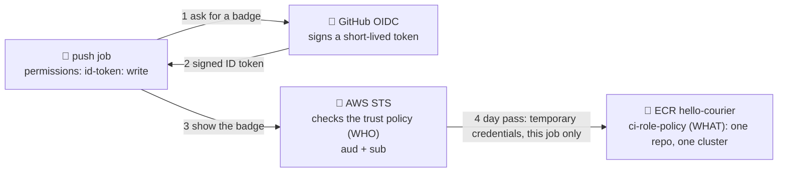

# 🪪 Lesson 06 — Secrets & least privilege: the courier's badge

**📍 You are here:** Lesson **06** of 12 · Previous: `lesson-05-artifacts-reports` · Next: `lesson-07-build-push-image`

---

## 📦 What's in this branch

Lessons 01–05, **plus** the rule that keeps the mailroom safe — the courier does not carry the school's master key. Real files:

- [iam/github-oidc-trust-policy.json](../../iam/github-oidc-trust-policy.json) — **WHO** may wear the CI hat: runs of this repo's `main` branch
- [iam/ci-role-policy.json](../../iam/ci-role-policy.json) — **WHAT** the hat may do: push to one ECR repository, describe one cluster
- [.github/workflows/ship.yml](../../.github/workflows/ship.yml) and [ci.yml](../../.github/workflows/ci.yml) — the `permissions:` blocks and the `🪪 show the badge` step
- [.circleci/config.yml](../../.circleci/config.yml), [.gitlab-ci.yml](../../.gitlab-ci.yml), [Jenkinsfile](../../Jenkinsfile) — contexts, `id_tokens`, `withAWS`

## 🧒 Explain like I'm 5

The courier robot 📮 has to get into the locker room 🏦 to file the photocopies. The lazy way:
give it the **master key** 🔑 — it opens the whole building, has no expiry date, and if the robot
drops it in the corridor, whoever finds it owns the school. In CI that key is a stored AWS access key.

The school way: the robot wears a **badge** 🪪 saying *"courier of THIS school, on THIS route"*.
The guard checks it against a guest list — signed by the school office? meant for this door? this
route? — and hands over a **day pass** 🎫 that opens **one** locker and stops working in about an hour.
That is **OIDC**: GitHub signs the badge, AWS STS is the guard, the **trust policy** is the guest list, the **permissions policy** is the list of doors the pass opens.

Two more things in the courier's pocket. **Variables** are notes pinned on the notice board — a region,
a repository name — anyone may read them. **Secrets** are sealed envelopes the mailroom blacks out in the
logs it prints. But the marker only recognizes the exact text; photocopy the letter sideways (base64 it, split it, write it to a file) and the marker misses it.

## 🗺️ Diagram



## ❓ What

- **Secret** = a value the CI system stores encrypted, hides after saving and **masks** (`***`) in logs:
  `${{ secrets.NAME }}`. **Variable** = plain configuration, readable in Settings, printed as-is:
  `${{ vars.NAME }}`. This repo's four AWS settings are variables — a role ARN and a region are *addresses*, not keys.
- **Masking** = exact-string replacement in the log. `echo $SECRET` prints `***`, but the
  value written to a file, an artifact or a URL, or piped through `base64`, is still a leak.
- **`permissions:`** = what the run's own `GITHUB_TOKEN` may do; listing any permission sets the unlisted ones
  to none. `id-token: write` means "may *request* an OIDC token" — the "write" is about asking, not writing anywhere.
- **Trust policy** = **WHO** may assume the role, checked by STS against the token's `aud` and `sub` claims. **Permissions policy** = **WHAT** the role may do.

### 🧠 Master key vs badge

| | 🔑 stored access keys | 🪪 badge → 🎫 day pass (OIDC) |
|---|---|---|
| where it lives | in a secret, until someone rotates it | nowhere — minted per job |
| if it leaks | valid until noticed and rotated | expires within the hour; useless outside the trust policy |
| what it opens | whatever the IAM user has | only what the role's policy lists |

## 🤔 Why

Leaked CI credentials are a classic incident: a key printed in a log, copied into an artifact, or read
by a workflow from a fork. A stored key also has to be rotated, and in practice rarely is. OIDC removes the
stored key, and the two IAM files shrink the blast radius to one repository and one cluster. It is the AWS
school's ["badges for robots"](https://baluraut.github.io/learn-aws-school/lesson-diagrams.html#l05) with a GitHub runner instead of an EC2 instance, plus its [IAM hygiene lesson](https://baluraut.github.io/learn-aws-school/lesson-diagrams.html#l06) applied to a pipeline.

## 🔧 How (in this repo)

**Least privilege for the run's own token.** [ci.yml](../../.github/workflows/ci.yml) grants only `contents: read`; [ship.yml](../../.github/workflows/ship.yml) adds the one thing the badge needs:

```yaml
permissions:
  contents: read
  id-token: write           # lesson 06: lets this run ask for an OIDC badge — no stored AWS keys
```

**The badge step.** The `push` job runs only when the variable exists (`if: vars.AWS_ROLE_ARN != ''` — a fork without AWS skips it and stays green). Five lines, four steps:

```yaml
      - name: 🪪 show the badge, get a day pass (OIDC → temporary credentials)
        uses: aws-actions/configure-aws-credentials@v4
        with:
          role-to-assume: ${{ vars.AWS_ROLE_ARN }}
          aws-region: ${{ vars.AWS_REGION }}
```
1. Allowed by `id-token: write`, the action asks GitHub for a token; GitHub signs one with `aud` = `sts.amazonaws.com` and `sub` = `repo:BaluRaut/learn-cicd-school:ref:refs/heads/main`.
2. The action calls STS `AssumeRoleWithWebIdentity` with that token and the role ARN.
3. STS verifies GitHub's signature, then checks the role's **trust policy**: does `aud` equal, does `sub` match?
4. STS returns **temporary credentials** (key, secret, session token — one hour by default), which the action exports as environment variables for *this job only*. Job over, credentials gone.

**WHO — the trust policy**, [iam/github-oidc-trust-policy.json](../../iam/github-oidc-trust-policy.json):

```json
      "Principal": { "Federated": "arn:aws:iam::123456789012:oidc-provider/token.actions.githubusercontent.com" },
      "Action": "sts:AssumeRoleWithWebIdentity",
      "Condition": {
        "StringEquals": { "token.actions.githubusercontent.com:aud": "sts.amazonaws.com" },
        "StringLike":   { "token.actions.githubusercontent.com:sub": "repo:BaluRaut/learn-cicd-school:ref:refs/heads/main" }
      }
```
The `sub` line is the whole point: a run from another repository, or from a feature branch of this one, presents
a different `sub` and is refused. Your fork's runs carry `repo:<your-user>/learn-cicd-school:…`, so a role for your fork needs your name there.

**WHAT — the permissions policy**, [iam/ci-role-policy.json](../../iam/ci-role-policy.json) (the middle statement's seven `ecr:` actions elided):

```json
    { "Sid": "EcrLogin", "Effect": "Allow", "Action": "ecr:GetAuthorizationToken", "Resource": "*" },
    {
      "Sid": "EcrPushOneRepo",
      …
      "Resource": "arn:aws:ecr:ap-south-1:123456789012:repository/hello-courier"
    },
    { "Sid": "FindTheCluster", "Effect": "Allow", "Action": "eks:DescribeCluster",
      "Resource": "arn:aws:eks:ap-south-1:123456789012:cluster/school-eks" }
```
`GetAuthorizationToken` is the registry login and is account-wide by design, so it needs `*`. The elided actions upload
layers and put an image — nothing that deletes or creates repositories — and each remaining line names **one** repository or **one** cluster. No `ecr:*`, no `eks:*`, no `iam:*`.

<details><summary>🔁 The same thing in CircleCI</summary>

```yaml
      - test:                            # NO context: tests never see cloud credentials
      - build-and-push:
          context: school-cicd
          requires: [test]
```
A **context** is a named bundle of environment variables in the organization settings; only the jobs that
list it receive it. Inside `build-and-push`, `aws-cli/setup` with `role_arn: ${AWS_ROLE_ARN}` does the same badge exchange with CircleCI's own OIDC token.
</details>

<details><summary>🦊 The same thing in GitLab CI</summary>

```yaml
  id_tokens:
    GITLAB_OIDC_TOKEN:
      aud: https://gitlab.com
```
`id_tokens:` makes GitLab mint the badge into `$GITLAB_OIDC_TOKEN`; the `.aws-badge` anchor's `before_script` then runs
`aws sts assume-role-with-web-identity` by hand and exports the three credentials. Only jobs that merge in `<<: *aws-badge` get it — the `test` job does not.
</details>

<details><summary>🎩 The same thing in Jenkins</summary>

```groovy
        withAWS(credentials: 'aws-school-cicd', region: env.AWS_REGION) {
```
Jenkins keeps credentials in its own store and `withAWS` (Pipeline: AWS Steps plugin) exposes them only inside the block.
Nothing hosted signs a badge for Jenkins out of the box, so the honest setup is an agent on an EC2 instance or pod that already holds an IAM role — AWS school lesson 05 again.
</details>

## 🧪 Try it

```bash
# 1) read the two lists — no AWS needed
cat iam/github-oidc-trust-policy.json iam/ci-role-policy.json   # WHO: aud + sub · WHAT: one repo, one cluster

# 2) what your fork (lesson 03) carries: no variables → push/deploy skipped; no secrets → no stored keys
gh variable list && gh secret list

# 3) OPTIONAL — needs an AWS account (ECR storage and transfer may cost a little)
ACCOUNT=$(aws sts get-caller-identity --query Account --output text); ME=$(gh api user --jq .login)
aws iam create-open-id-connect-provider --url https://token.actions.githubusercontent.com --client-id-list sts.amazonaws.com   # older AWS CLIs also insist on --thumbprint-list
# drop the "_comment" line (IAM accepts only known keys); put YOUR account id and GitHub user in
grep -v '"_comment"' iam/github-oidc-trust-policy.json | sed -e "s/123456789012/$ACCOUNT/" -e "s|repo:BaluRaut/|repo:$ME/|" > /tmp/trust.json
grep -v '"_comment"' iam/ci-role-policy.json | sed "s/123456789012/$ACCOUNT/" > /tmp/perms.json
aws iam create-role --role-name learn-cicd-school-ci --assume-role-policy-document file:///tmp/trust.json
aws iam put-role-policy --role-name learn-cicd-school-ci --policy-name ci --policy-document file:///tmp/perms.json
aws ecr create-repository --repository-name hello-courier --region ap-south-1 --image-scanning-configuration scanOnPush=true
gh variable set AWS_ROLE_ARN --body "arn:aws:iam::$ACCOUNT:role/learn-cicd-school-ci"
gh variable set AWS_REGION --body ap-south-1 && gh variable set ECR_REPOSITORY --body hello-courier
# leave EKS_CLUSTER unset until lesson 10: the next push to main runs "push to ECR"; deploy stays skipped
```

### ⚠️ Common mistakes

- storing the role ARN or region as a *secret* "to be safe" — they are addresses; masking then hides useful log lines, and a job-level `if:` can test `vars` but not `secrets`
- a trust policy without the `sub` condition (or with a wide wildcard) — any GitHub repository able to obtain a token for `sts.amazonaws.com` could then assume the role
- treating `***` in the log as proof of safety — a secret written to a file, an artifact, a URL, or piped through `base64` walks past the mask

## ⏭️ Next

Day pass in hand, the courier walks to the photocopier: build the box, prove it starts, write the commit's fingerprint on it, file it in the locker. 📦

```bash
git checkout lesson-07-build-push-image
```
