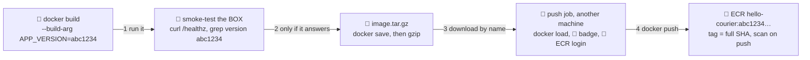

# 📦 Lesson 07 — Build & push the image: the photocopier

**📍 You are here:** Lesson **07** of 12 · Previous: `lesson-06-secrets-oidc` · Next: `lesson-08-environments-gates`

---

## 📦 What's in this branch

Lessons 01–06, **plus** the photocopier desk: the checked homework becomes a box, gets the commit's fingerprint, and is filed in the locker. Real files:

- [.github/workflows/ship.yml](../../.github/workflows/ship.yml) — the `build` job (build, smoke-test, save) and the `push` job (load, badge, ECR login, tag, push)
- [app/Dockerfile](../../app/Dockerfile) and [app/server.js](../../app/server.js) — `ARG APP_VERSION` is baked in, and `/` prints `version …` so a running copy can say which commit it is
- [.circleci/config.yml](../../.circleci/config.yml), [.gitlab-ci.yml](../../.gitlab-ci.yml), [Jenkinsfile](../../Jenkinsfile) — the same build, smoke, tag, push in one job each

## 🧒 Explain like I'm 5

The checking desk ✅ stamped the homework. Now the **photocopier** 🍱 makes the
copy that goes on the notice boards, and this desk has three habits.

**Write the fingerprint on the copy while copying.** A commit has a 40-character fingerprint, the
**SHA**. Its first 7 characters go *inside* the box as `APP_VERSION`, so the running app can answer
"which copy are you?" The full SHA goes *on the label* — the image **tag** — so the locker shelf answers
the same question by name. Not `latest`, not `main`: those point at different bytes from week to week.

**Look at the copy before filing it.** The tests ran on the runner's Node; the box has its own Node,
its own files, its own port. So the desk starts the box, asks `/healthz` until it answers, and checks
that `/` prints the expected version. That is a **smoke test of the box**, not of the code.

**Hand it over properly.** The photocopier and the filing desk are different
rooms, so the copy travels in the envelope from lesson 05; the filing desk opens
the locker 🏦 with the day pass from lesson 06; the locker X-rays each new box (**scan on push**).

## 🗺️ Diagram



## ❓ What

- **Build argument** = `--build-arg APP_VERSION=…` → `ARG` → `ENV` in the Dockerfile
  → `process.env.APP_VERSION` in `server.js`. The **version label** is the **short SHA** (7 characters).
- **Smoke test** = start the container, poll `/healthz` until it returns 200, then check `/`
  prints `version <short SHA>`. It proves the box starts, listens on port 3000, and was built from *this* commit.
- **Image tag = the full commit SHA** (40 characters). Same tag, same bytes; `git show <sha>` finds the code; a deploy
  later is "change this string". A **moving tag** (`main`, `latest`) points at different images over time — fine as a bookmark, wrong as a deploy target.
- **Scan on push** = ECR checks each new image's layers for known CVEs; a setting of the repository, not of the pipeline.

### 🧠 One fingerprint, inside and out

```text
commit  abc1234ef56…  (40 chars — git's fingerprint of the code)
   ├─ INSIDE the box:  APP_VERSION=abc1234            (short SHA — what the app prints)
   └─ ON the label:    hello-courier:abc1234ef56…     (full SHA — what you deploy by)
```

**Tag vs digest.** The commit-SHA tag tells us which source revision produced the image;
the image **digest** (`sha256:…`, shown by `docker image inspect` and in the ECR console)
identifies the exact immutable image bytes. Build the same commit twice and you get one tag
but possibly two digests — the tag is the address, the digest is the identity, as the
[Docker school's lesson 11](https://baluraut.github.io/learn-docker-school/lesson-diagrams.html#l11)
puts it. Lesson 12 pins base images by digest for the same reason.

## 🤔 Why

Without the version baked in, "which version is running?" is a guess. Without the smoke test, a Dockerfile
that forgets a file passes the unit tests and dies at the first readiness probe. Without SHA tags, "put back
yesterday's" is impossible, `latest` quietly lies, and GitOps commits later have nothing meaningful to change.
The [Docker school's lesson 12](https://baluraut.github.io/learn-docker-school/lesson-diagrams.html#l12) ends on this exact handoff; its [lesson 08](https://baluraut.github.io/learn-docker-school/lesson-diagrams.html#l08) covers tag hygiene.

## 🔧 How (in this repo)

**Bake the fingerprint.** [app/Dockerfile](../../app/Dockerfile) takes it as a build argument and freezes it into the environment:

```dockerfile
ARG APP_VERSION=dev                 # CI passes the commit SHA here (lesson 07)
ENV APP_VERSION=$APP_VERSION
```

**Build and smoke-test the box.** The `build` job in [ship.yml](../../.github/workflows/ship.yml) —
`${GITHUB_SHA::7}` is bash for "the first 7 characters"; the loop gives the box roughly ten seconds to start:

```yaml
      - name: 🍱 docker build (version label = short SHA)
        run: docker build --build-arg APP_VERSION=${GITHUB_SHA::7} -t hello-courier:${GITHUB_SHA} app
      - name: 🧪 test the BOX, not just the code
        run: |
          docker run -d --rm -p 3000:3000 --name smoke hello-courier:${GITHUB_SHA}
          for i in $(seq 1 20); do curl -fsS localhost:3000/healthz && break; sleep 0.5; done
          curl -fsS localhost:3000/ | grep -q "version ${GITHUB_SHA::7}"
          docker stop smoke
      - name: 💾 keep the image for the push job (same run, different machine)
        run: docker save hello-courier:${GITHUB_SHA} | gzip > image.tar.gz
```
The `grep -q` line catches a stale or mislabeled build: if the box prints `version dev`, the job fails before anything is pushed.

**Load, log in, tag, push.** The `push` job lands on a fresh machine, so it starts from the envelope, shows the lesson 06 badge, then:

```yaml
      - run: docker load < image.tar.gz
      - name: 🎫 log in to ECR
        id: ecr
        uses: aws-actions/amazon-ecr-login@v2
      - name: 🏷️ tag with the commit SHA and push
        id: meta
        env:
          IMAGE: ${{ steps.ecr.outputs.registry }}/${{ vars.ECR_REPOSITORY }}:${{ github.sha }}
        run: |
          docker tag hello-courier:${GITHUB_SHA} "$IMAGE"
          docker push "$IMAGE"
          echo "image=$IMAGE" >> "$GITHUB_OUTPUT"
```
`amazon-ecr-login` turns the day pass into a `docker login` and outputs the `registry` hostname, so `IMAGE` becomes
`123456789012.dkr.ecr.ap-south-1.amazonaws.com/hello-courier:<full sha>` — exported as the job's `image` output, the exact
string the delivery van receives in lesson 10. Scan results appear next to the image in the ECR console (the repository was created with `scanOnPush=true` in lesson 06).

<details><summary>🔁 The same thing in CircleCI</summary>

```yaml
            IMAGE="${REGISTRY}/${ECR_REPOSITORY}:${CIRCLE_SHA1}"
            docker build --build-arg APP_VERSION=${CIRCLE_SHA1:0:7} -t "$IMAGE" app
            docker run -d --rm -p 3000:3000 --name smoke "$IMAGE"
            sleep 2 && docker exec smoke wget -qO- localhost:3000/healthz && docker stop smoke
            docker push "$IMAGE"
```
One job builds, logs in with `aws ecr get-login-password` and pushes, so no envelope is needed. With
`setup_remote_docker` the container runs on a separate engine, which is why the smoke test uses `docker exec smoke wget` rather than `curl localhost`.
</details>

<details><summary>🦊 The same thing in GitLab CI</summary>

```yaml
    - IMAGE="${REGISTRY}/${ECR_REPOSITORY}:${CI_COMMIT_SHA}"
    - docker build --build-arg APP_VERSION=${CI_COMMIT_SHORT_SHA} -t "$IMAGE" app
    - docker run -d --rm -p 3000:3000 --name smoke "$IMAGE" && sleep 2 && docker exec smoke wget -qO- localhost:3000/healthz && docker stop smoke
    - docker push "$IMAGE"
```
`CI_COMMIT_SHA` is the full SHA; GitLab's built-in `CI_COMMIT_SHORT_SHA` is 8 characters, so the version
line reads one character longer in this dialect. Docker itself comes from the `docker:27-dind` service.
</details>

<details><summary>🎩 The same thing in Jenkins</summary>

```groovy
            IMAGE="${REGISTRY}/${ECR_REPOSITORY}:${GIT_COMMIT}"
            docker build --build-arg APP_VERSION=$(echo "$GIT_COMMIT" | cut -c1-7) -t "$IMAGE" app   # POSIX sh: no ${VAR:0:7}
            docker run -d --rm -p 3000:3000 --name smoke "$IMAGE" && sleep 2 \
              && docker exec smoke wget -qO- localhost:3000/healthz && docker stop smoke
            docker push "$IMAGE"
```
`GIT_COMMIT` is Jenkins' full SHA. The whole `sh` block sits inside the `withAWS(...)` from lesson 06,
logs in the same way, and the agent needs a Docker CLI of its own.
</details>

## 🧪 Try it

```bash
SHA=$(git rev-parse HEAD)                       # 1) build exactly like CI, from your checkout — no AWS needed
docker build --build-arg APP_VERSION=${SHA::7} -t hello-courier:${SHA} app

# 2) smoke-test the BOX — the same lines as ship.yml
docker run -d --rm -p 3000:3000 --name smoke hello-courier:${SHA}
for i in $(seq 1 20); do curl -fsS localhost:3000/healthz && break; sleep 0.5; done
curl -fsS localhost:3000/ | grep -q "version ${SHA::7}" && echo "✅ the box says ${SHA::7}"
docker stop smoke

# 3) the version is baked in, not guessed
docker image inspect hello-courier:${SHA} --format '{{json .Config.Env}}'   # …"APP_VERSION=abc1234"…

# 4) the same build ran in your fork's mailroom — the build job needs no AWS
RUN=$(gh run list --workflow ship.yml --limit 1 --json databaseId --jq '.[0].databaseId')
gh run view "$RUN"     # "build & smoke-test the image" ✅ · "push to ECR" skipped without the lesson 06 variables
```

### ⚠️ Common mistakes

- deploying by `latest` or a branch name — the tag stops meaning one set of bytes, and "put back yesterday's" becomes guesswork
- testing the code but not the box — a `COPY` that misses a file, a wrong `USER` or port passes unit tests and dies at the first probe
- rebuilding in the push job "because it's quick" — the pushed image is no longer the one you smoke-tested; carry the envelope instead

## ⏭️ Next

The copy is in the locker with its fingerprint. Before it reaches the main board it goes on the practice board first — and the principal signs. 🛑

```bash
git checkout lesson-08-environments-gates
```
