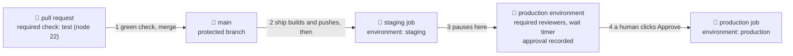

# 🛑 Lesson 08 — Environments & approval gates: the principal's signature

**📍 You are here:** Lesson **08** of 12 · Previous: `lesson-07-build-push-image` · Next: `lesson-09-deploy-strategies`

---

## 📦 What's in this branch

Lessons 01–07, **plus** the two doors between a green check and the main notice board: the front door (branch protection) and the principal's office (the approval gate). Real files:

- [.github/workflows/deploy.yml](../../.github/workflows/deploy.yml) — `environment: staging`, then `environment: production` behind required reviewers
- [.github/workflows/ship.yml](../../.github/workflows/ship.yml) — the `🚚 deliver` job that calls `deploy.yml` after a successful push
- [.github/workflows/ci.yml](../../.github/workflows/ci.yml) — `name: test (node ${{ matrix.node }})`: the check name you make required
- [.circleci/config.yml](../../.circleci/config.yml), [.gitlab-ci.yml](../../.gitlab-ci.yml), [Jenkinsfile](../../Jenkinsfile) — `type: approval`, `when: manual`, `input`

## 🧒 Explain like I'm 5

The school has two notice boards. The **practice board** 📌 in the staff room
is where the courier pins a new notice first, so a teacher can check it reads
right. The **main board** in the hall is what the classes see. In CI those are
**staging** and **production** — in this course, two namespaces on one cluster.

Between the boards sits the **principal's office** 🛑. The van waits at the
door with the notice until a named person signs, and the signature goes in a
log book: who, when, which notice. That is an **approval gate** — the run
pauses on the production job until a **required reviewer** clicks Approve.

There is an earlier door too. Homework that failed the checking desk ✅
shouldn't reach the "to copy" tray at all. **Branch protection** makes the
`test (node 22)` check a condition of the merge button: red check, no merge.

The route is **trunk-based**: small changes merge into `main` often (branches
live hours, not weeks), and `main` is the one thing that gets built and shipped.
The gate is not "which branch" — it is "which check passed, and who signed".

## 🗺️ Diagram



## ❓ What

- **Environment** (GitHub) = a named deploy target (`staging`, `production`) with its own
  protection rules, secrets and variables. A job that declares `environment: production` runs under its rules.
- **Required reviewers** = up to six people or teams; one of them must approve before the job may start.
  Optional: *prevent self-review*. **Wait timer** = a fixed delay in minutes (up to 30 days) before the job may proceed.
- **Deployment branches and tags** = which refs may deploy there — "protected branches only" or a named list such as `main`.
- **Branch protection** (or a **ruleset**) = rules on `main`: require a pull request, require **status checks**
  to pass, optionally require reviews. The check is named after the job — `name: test (node ${{ matrix.node }})` gives `test (node 22)`.
- **Audit trail** = each environment deployment records the run, the approver, the time and any comment.

### 🧠 Two doors, two questions

| door | where | the question | who answers |
|---|---|---|---|
| front door | pull request → `main` | did the checking desk stamp ✅? | the robot — a required status check |
| principal's office | staging → production | should *this* copy go on the main board? | a named human — a required reviewer |

## 🤔 Why

A green test says the code behaves; it says nothing about the config, the
cluster, or the image that was actually built. Staging catches that class of
surprise cheaply. The approval buys a human a moment and buys the school a
record: when the main board breaks, "who approved what, when" is a lookup, not
an argument. Branch protection makes the rest hold — a gate on production is worth
little if untested code can walk into `main`. The ArgoCD school's
[lesson 03](https://baluraut.github.io/learn-argocd-school/lesson-diagrams.html#l03) starts from this exact push pipeline before it replaces the van.

## 🔧 How (in this repo)

**Two jobs, two environments.** [deploy.yml](../../.github/workflows/deploy.yml) runs staging, then production; `needs:` orders them, `environment:` attaches the rules:

```yaml
  staging:
    runs-on: ubuntu-latest
    environment: staging                          # the practice notice board

  production:
    needs: staging
    runs-on: ubuntu-latest
    environment: production                       # 🛑 required reviewers = the principal's signature
```
Nothing in the YAML says "wait for approval". As the file's header puts it, the `production`
environment "must be created once in Settings → Environments with *Required reviewers* — THAT checkbox is the approval gate".

**How the pause works.** When the run reaches the `production` job, GitHub evaluates the
environment's protection rules. With required reviewers set, the job shows *Waiting* and the
run summary grows a **Review deployments** button. A listed reviewer approves or rejects, with
an optional comment; approve → the job starts with that environment's secrets and variables,
reject → the job fails. The decision is kept with the run (the summary shows who approved) and in
the environment's deployment history — also readable with `gh api repos/{owner}/{repo}/actions/runs/<id>/approvals`.

**Setting it up (once, in the fork).** Settings → Environments → **New environment** → `production`
→ tick **Required reviewers** and add yourself → optionally a **Wait timer** → **Deployment branches
and tags** → selected branches → `main`. Create `staging` too, with no reviewers. Public repositories
get protection rules on the current plans; private ones may need a paid plan — check GitHub's docs.

**The front door.** Settings → Branches (classic) or Settings → Rules (rulesets) → protect `main` →
*Require status checks to pass before merging* → add `test (node 22)`. A pull request with a red check then shows *Merging is blocked*.

**Where the van is called.** In [ship.yml](../../.github/workflows/ship.yml) the `🚚 deliver` job
(`uses: ./.github/workflows/deploy.yml`) only exists once `vars.EKS_CLUSTER` is set — on a fork without AWS it is skipped, by design.

<details><summary>🔁 The same thing in CircleCI</summary>

```yaml
      - hold-for-approval:               # 🛑 the principal's signature: click Approve in the UI
          type: approval
          requires: [deploy-staging]
```
An approval job is a placeholder with no steps; the workflow stops there until someone with write
access to the project clicks it, `deploy-production` lists it in `requires:`, and the workflow page shows who clicked.
</details>

<details><summary>🦊 The same thing in GitLab CI</summary>

```yaml
deploy-production:
  <<: *deploy
  needs: [deploy-staging]
  environment: { name: production }
  when: manual                                # 🛑 the principal's signature: a human presses ▶ in the UI
```
`when: manual` draws the play button; `environment:` files the deployment under Operate → Environments
with its history. Restricting *who* may press play is a **protected environment**, a paid-tier feature at the time of writing.
</details>

<details><summary>🎩 The same thing in Jenkins</summary>

```groovy
    stage('🛑 approve') {
      options { timeout(time: 2, unit: 'DAYS') }
      steps { input message: 'Deploy to production?', ok: 'Approve' }   // the principal's signature
    }
```
`input` pauses the build and the approver's name lands in the build log. The two-day `timeout` aborts a
forgotten build instead of holding it open indefinitely; `input` also takes a `submitter:` list naming who may click (`# illustrative`).
</details>

## 🧪 Try it

This works on a public fork without AWS. The deploy jobs themselves stay skipped until the
lesson 06 variables and `EKS_CLUSTER` exist, so the *Review deployments* button appears only once staging has actually run.

```bash
# 1) the front door: make "test (node 22)" a required check on main, for admins too
gh api -X PUT "repos/{owner}/{repo}/branches/main/protection" --input - <<< '{ "required_status_checks":
  { "strict": true, "contexts": ["test (node 22)"] }, "enforce_admins": true, "required_pull_request_reviews": null, "restrictions": null }'

# 2) open a PR that breaks a test and watch the merge get blocked
git checkout -b break-a-test
sed -i.bak 's/writeHead(404/writeHead(500/' app/server.js && rm app/server.js.bak
git commit -am "break the 404 test on purpose" && git push -u origin break-a-test
gh pr create --fill && gh pr checks --watch     # test (node 22) ❌
gh pr merge --squash                            # refused: the base branch policy prohibits the merge
git checkout main && gh pr close break-a-test --delete-branch

# 3) the principal's office: create the production environment with yourself as reviewer
gh api -X PUT "repos/{owner}/{repo}/environments/production" --input - <<JSON
{ "wait_timer": 0, "reviewers": [ { "type": "User", "id": $(gh api user --jq .id) } ],
  "deployment_branch_policy": { "protected_branches": true, "custom_branch_policies": false } }
JSON
# then open Settings → Environments → production in the browser and read the three switches
```

### ⚠️ Common mistakes

- protecting `main` but not enforcing it for administrators — the one person who can bypass the rule is usually the one in a hurry
- writing `environment: production` and assuming that alone gates anything — with no protection rules configured, the job runs straight through
- one reviewer, no wait timer, self-review allowed, on a team repository — a gate one tired person can open at 2 a.m. is a formality

## ⏭️ Next

The principal signed. Now, *how* does the new notice replace the old one without a blank board in between — and how do you put yesterday's back? 🔁

```bash
git checkout lesson-09-deploy-strategies
```
