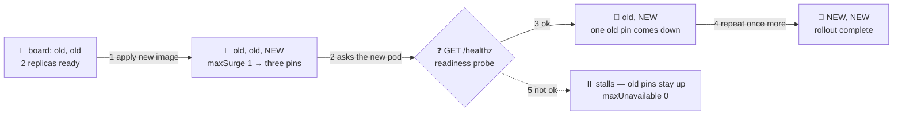

# 🔁 Lesson 09 — Deploy strategies & rollback: replace the pins one by one

**📍 You are here:** Lesson **09** of 12 · Previous: `lesson-08-environments-gates` · Next: `lesson-10-deploy-to-kubernetes`

---

## 📦 What's in this branch

Lessons 01–08, **plus** what happens at the board once the van arrives: *how*
a new notice replaces the old one without a reader ever facing a blank wall,
and how to put yesterday's notice back. Real files:

- [k8s/deployment.yaml](../../k8s/deployment.yaml) — the notice board: `strategy: RollingUpdate`, `maxSurge: 1`, `maxUnavailable: 0`, and the readiness probe on `/healthz` that gates each step
- [k8s/service.yaml](../../k8s/service.yaml) — the "read here →" sign; its `selector` is what a blue/green flip changes
- [.github/workflows/deploy.yml](../../.github/workflows/deploy.yml) — the van; its last two lines are the rollback recipe
- [app/Dockerfile](../../app/Dockerfile) — `ARG APP_VERSION` is how the lab tells v1 from v2

## 🧒 Explain like I'm 5

The main notice board 📌 holds **two copies** of today's notice, so a crowd
can read from both sides. A new version arrives. How do you swap it?

**Rolling** 🔁: pin ONE new copy next to the old two (three on the board for
a moment), wait until someone confirms it is actually readable ("are you
ready?" — the **readiness probe**), then take one old copy down. Repeat. The
board stays readable the whole time. That is what this repo's Deployment does.

**Recreate** 🧹 rips both old copies down, then pins the new ones — simple,
but the board is blank for a few seconds. **Blue/green** 🔵🟢 keeps TWO whole
boards: pin the new notice on the empty one, check it, then swing the "read
here →" sign over. Undo = swing it back.

**Canary** 🐤: show the new notice to *one class* first. If they do not
complain, show everyone. Tools such as **Argo Rollouts** and **Flagger** turn
"if they do not complain" into an automatic decision — they exist, we only
name them here.

And **rollback** ⏪ is not magic: yesterday's notice is still in the locker,
labeled with yesterday's commit. Pin it again.

## 🗺️ Diagram



## ❓ What

- **RollingUpdate** = replace pods gradually. `maxSurge` = how many *extra*
  pods may exist during the swap; `maxUnavailable` = how many may be missing.
  This repo: surge 1, unavailable 0 → at most 3 pods, and the controller keeps
  at least 2 ready.
- **Readiness probe** = the question asked of a new pod before the Service
  sends it traffic *and* before the rollout moves on. Here: `GET /healthz` on
  port 3000 ([Kubernetes school L07](https://baluraut.github.io/learn-kubernetes-school/lesson-diagrams.html#l07)).
- **Recreate** = `strategy: { type: Recreate }`: old pods stop, then new ones
  start. Downtime by design; for when two versions cannot coexist.
- **Blue/green** = two Deployments, one Service; the Service `selector` decides
  which is live. Instant switch, instant undo, double the pods for a while.
- **Canary** = a small share of traffic to the new version first. Inside one
  cluster: a second, smaller Deployment behind the same Service. Across whole
  stacks: Route 53 weighted records ([AWS school L23](https://baluraut.github.io/learn-aws-school/lesson-diagrams.html#l23)).
- **Rollback** = deploy the previous version. Preferred: re-run the deploy with
  yesterday's image tag — the tag IS the version, and the run is logged.
  Emergency lever: `kubectl rollout undo`, which flips back to the previous ReplicaSet.
- **Deploy ≠ release**: deploying puts code on the board; releasing lets users
  see it. A **feature flag** separates the two, so a deploy can be boring.

### 🧠 Old and new run at the same time — plan for it

```text
rolling update · replicas 2 · maxSurge 1 · maxUnavailable 0

t0   old old          2 ready                 apply the new image
t1   old old NEW      2 ready + 1 starting    probe asks NEW: GET /healthz
t2   old NEW          2 ready                 one old pod gone, second NEW starting
t3   NEW NEW          2 ready                 rollout status exits 0 → the van reports ✅
```

Between t1 and t3 **both versions serve traffic**. That is why a database
change needs **expand / contract**: first ship a schema both versions accept
(add the new column, keep the old one), then ship the code that uses it, and
only later remove what the old code needed. A single "rename the column"
migration during a rolling update breaks whichever version is still running.

## 🤔 Why

A pipeline that applies YAML is only as safe as the strategy inside that YAML.
With `maxUnavailable: 0` and a probe, a broken image **stalls** instead of
taking the site down — the old pods keep serving while `rollout status` waits
and finally fails the job. Without the probe, Kubernetes would treat the new
pod as fine the instant the process starts and retire the old ones. The
Kubernetes school covers the rollout mechanics in
[L11](https://baluraut.github.io/learn-kubernetes-school/lesson-diagrams.html#l11);
here we care about what the *van* sees: a gate that passes or fails.

## 🔧 How (in this repo)

The strategy lives in the manifest, not in any pipeline file — all four
dialects apply the same [k8s/deployment.yaml](../../k8s/deployment.yaml):

```yaml
spec:
  replicas: 2
  selector:
    matchLabels: { app: hello-courier }
  strategy:
    type: RollingUpdate                 # lesson 09: replace the pins one at a time
    rollingUpdate: { maxSurge: 1, maxUnavailable: 0 }
  template:
    metadata:
      labels: { app: hello-courier }
    spec:
      containers:
        - name: web
          image: IMAGE_PLACEHOLDER      # CI swaps in ACCOUNT.dkr.ecr.REGION.amazonaws.com/hello-courier:<sha>
          ports: [{ containerPort: 3000 }]
          readinessProbe:               # the rollout only proceeds when the new pod answers /healthz
            httpGet: { path: /healthz, port: 3000 }
            initialDelaySeconds: 2
            periodSeconds: 5
```

The van waits for the swap and treats a timeout as a failed delivery
([deploy.yml](../../.github/workflows/deploy.yml), production job):

```yaml
          kubectl apply -n production -f k8s/
          kubectl rollout status -n production deployment/hello-courier --timeout=180s
      # rollback = kubectl rollout undo deployment/hello-courier -n production   (lesson 09)
      # …or, better, re-run this workflow with yesterday's image tag: the tag IS the version.
```

Blue/green is *not* in this repo; the shape is two Deployments (`color: blue`,
`color: green` in their pod labels) and a one-line Service change:

```yaml
# illustrative — k8s/service.yaml with a color in the selector
spec:
  selector: { app: hello-courier, color: blue }   # flip to green once green passes its checks
  ports: [{ port: 80, targetPort: 3000 }]
```

<details><summary>🔁 The same thing in CircleCI</summary>

```yaml
            kubectl apply -n << parameters.namespace >> -f k8s/
            kubectl rollout status -n << parameters.namespace >> deployment/hello-courier --timeout=180s
```
</details>

<details><summary>🦊 The same thing in GitLab CI</summary>

```yaml
    - kubectl apply -n "$NAMESPACE" -f k8s/
    - kubectl rollout status -n "$NAMESPACE" deployment/hello-courier --timeout=180s
```
</details>

<details><summary>🎩 The same thing in Jenkins</summary>

```groovy
      kubectl apply -n ${namespace} -f k8s/
      kubectl rollout status -n ${namespace} deployment/hello-courier --timeout=180s
```
</details>

## 🧪 Try it

No AWS needed — a local cluster shows the pins moving.

```bash
# 0) a local cluster: kind (below) or Docker Desktop → Settings → Kubernetes → Enable
kind create cluster --name school
kubectl create namespace staging

# 1) photocopy v1 with a tag (CI uses the full commit SHA; any tag except "latest" works locally)
docker build --build-arg APP_VERSION=v1 -t hello-courier:v1 app
kind load docker-image hello-courier:v1 --name school     # kind only; Docker Desktop shares its daemon

# 2) pin it: the same placeholder swap as deploy.yml, piped so your working tree stays clean
sed "s|IMAGE_PLACEHOLDER|hello-courier:v1|" k8s/deployment.yaml | kubectl apply -n staging -f -
kubectl apply -n staging -f k8s/service.yaml
kubectl rollout status -n staging deployment/hello-courier --timeout=180s

# 3) v2: new tag, same manifest — watch the pins move one at a time
docker build --build-arg APP_VERSION=v2 -t hello-courier:v2 app
kind load docker-image hello-courier:v2 --name school
kubectl get pods -n staging -w &                          # leave the watcher running
sed "s|IMAGE_PLACEHOLDER|hello-courier:v2|" k8s/deployment.yaml | kubectl apply -n staging -f -
kubectl rollout status -n staging deployment/hello-courier --timeout=180s
kill %1
kubectl run -n staging smoke --rm -i --restart=Never --image=curlimages/curl -- -fsS http://hello-courier/
#    → 📮 hello from hello-courier-… · version v2

# 4) rollback, both ways
kubectl rollout undo -n staging deployment/hello-courier          # the emergency lever
kubectl rollout history -n staging deployment/hello-courier
sed "s|IMAGE_PLACEHOLDER|hello-courier:v1|" k8s/deployment.yaml | kubectl apply -n staging -f -   # preferred: redeploy yesterday's tag

# cleanup
kind delete cluster --name school
```

### ⚠️ Common mistakes

- shipping a Deployment with no readiness probe — the rollout proceeds on "process started", not "answers requests", and a broken image replaces the good pods
- rolling back with `kubectl rollout undo` and calling it done — the cluster now differs from what the pipeline last applied; redeploy the old tag so the run log and the board agree
- running a destructive schema migration in the same deploy as the code change — for the length of the rollout, old pods are still talking to that database

## ⏭️ Next

You have seen *what* the van does at the board. Now the van itself: how a
pipeline gets a day pass into the cluster, swaps the placeholder, and knows
when to drive home.

```bash
git checkout lesson-10-deploy-to-kubernetes
```
