# 🚚 Lesson 10 — Deploy to Kubernetes from CI: the delivery van

**📍 You are here:** Lesson **10** of 12 · Previous: `lesson-09-deploy-strategies` · Next: `lesson-11-four-dialects`

---

## 📦 What's in this branch

Lessons 01–09, **plus** the van's whole route: get a day pass, find the school,
swap the placeholder, pin the notice, wait until it is readable, drive home.
Real files:

- [.github/workflows/deploy.yml](../../.github/workflows/deploy.yml) — the van: the `staging` job, then the gated `production` job
- [.github/workflows/ship.yml](../../.github/workflows/ship.yml) — hands the van the image reference through `workflow_call`
- [k8s/deployment.yaml](../../k8s/deployment.yaml) · [k8s/service.yaml](../../k8s/service.yaml) — what gets applied, `IMAGE_PLACEHOLDER` waiting to be swapped
- [iam/ci-role-policy.json](../../iam/ci-role-policy.json) — `eks:DescribeCluster` is the one permission `update-kubeconfig` needs

## 🧒 Explain like I'm 5

The photocopies are in the locker 🏦 (lesson 07) and the principal's
signature rule is set (lesson 08). Someone still has to drive to school. 🚚

The van does the same four things on every trip:

1. **Shows its badge at the gate** 🪪 — no master key in the glove box. The
   OIDC badge buys a day pass (lesson 06), and the school's front desk has the
   van's name on its list.
2. **Asks where the school is** 🗺️ — `aws eks update-kubeconfig` writes the
   address and the gate pass into a kubeconfig file.
3. **Pins the notice** 📌 — writes today's copy number onto the notice
   (`sed` swaps `IMAGE_PLACEHOLDER`), then `kubectl apply`.
4. **Waits until it is readable** ⏳ — `kubectl rollout status` blocks until
   lesson 09's rolling update finishes, or gives up and reports a failed
   delivery. On the practice board it also asks a passing student to read the
   notice back (the in-cluster smoke test).

Then it drives home. And here is the catch: **once the van is gone, nobody in
the mailroom is watching the board**. If a teacher moves a pin by hand, the
mailroom finds out at the next delivery, if at all. Hold that thought for the
ArgoCD school.

## 🗺️ Diagram

```mermaid
flowchart LR
    ship["📦 ship.yml<br/>image = …/hello-courier:sha"]
    badge["🪪 configure-aws-credentials<br/>OIDC → day pass"]
    kc["🗺️ aws eks update-kubeconfig"]
    pin["📌 sed IMAGE_PLACEHOLDER<br/>kubectl apply -n staging"]
    wait["⏳ kubectl rollout status<br/>--timeout=180s"]
    smoke["🧪 kubectl run smoke<br/>curl hello-courier/healthz"]
    gate["🛑 environment: production<br/>required reviewers"]
    prod["📌 same four moves<br/>-n production"]
    drift["🤷 nobody watches the board<br/>→ ArgoCD school"]
    ship -->|"1 workflow_call"| badge
    badge -->|"2"| kc
    kc -->|"3"| pin
    pin -->|"4"| wait
    wait -->|"5 exit 0"| smoke
    smoke -->|"6"| gate
    gate -->|"7 approved"| prod
    prod -.->|"8 the van drives away"| drift
```



## ❓ What

- **Push model** = the pipeline holds credentials for the cluster and pushes
  changes in from outside. The alternative, the **pull model**, has an agent
  inside the cluster fetch desired state from git — that is the ArgoCD school.
- **`aws eks update-kubeconfig`** = writes a kubeconfig whose user entry runs
  `aws eks get-token`; it needs `eks:DescribeCluster` on the role, and the
  cluster must map that IAM role to a Kubernetes identity (EKS access entries,
  or the older `aws-auth` ConfigMap) — one setup step, not taught here.
- **The placeholder swap** = the manifest in git says `IMAGE_PLACEHOLDER`; the
  job writes the real reference in before applying. `sed` is the smallest tool
  that does it; `kustomize edit set image` and `helm upgrade --set image.tag=`
  are the tidier ones.
- **`kubectl rollout status --timeout`** = the pass/fail gate: exit 0 once the
  Deployment is complete, non-zero on a stalled rollout or when the timeout hits.
- **In-cluster smoke test** = `kubectl run … --image=curlimages/curl` curls the
  Service by its DNS name from inside the namespace, proving pods *and* Service
  wiring work — not just that a container started.
- **One namespace per environment**: `staging` and `production` are the same
  YAML applied twice with a different `-n`. Same manifests, different board.

### 🧠 The van's four moves — and what fails each one

| move | what runs | the job fails when |
|---|---|---|
| 🪪 badge | OIDC → temporary credentials | the trust policy's `sub` does not match this repo and branch |
| 🗺️ address | `aws eks update-kubeconfig` | the role lacks `eks:DescribeCluster`, or the cluster does not map it |
| 📌 pin | `sed` + `kubectl apply -n <ns> -f k8s/` | invalid YAML, or the mapped identity may not write to the namespace |
| ⏳ wait | `kubectl rollout status --timeout=180s` | the new pod never answers `/healthz` in time |

## 🤔 Why

Before this lesson, "deploy" meant a person with a kubeconfig on a laptop —
undocumented, hard to repeat, and tied to whoever holds the file. The van makes
it the same four commands each time, logged next to the commit, behind the
approval from lesson 08. The AWS school's
[L05](https://baluraut.github.io/learn-aws-school/lesson-diagrams.html#l05)
explains why the badge beats a stored key; the ArgoCD school's
[L03](https://baluraut.github.io/learn-argocd-school/lesson-diagrams.html#l03)
draws this exact pipeline, and its
[L04](https://baluraut.github.io/learn-argocd-school/lesson-diagrams.html#l04)
and [L05](https://baluraut.github.io/learn-argocd-school/lesson-diagrams.html#l05)
count what the van cannot see once the job ends and what to do about it.

## 🔧 How (in this repo)

The whole `staging` job of [deploy.yml](../../.github/workflows/deploy.yml):

```yaml
jobs:
  staging:
    runs-on: ubuntu-latest
    environment: staging                          # the practice notice board
    steps:
      - uses: actions/checkout@v4
      - uses: aws-actions/configure-aws-credentials@v4
        with: { role-to-assume: "${{ vars.AWS_ROLE_ARN }}", aws-region: "${{ vars.AWS_REGION }}" }
      - name: 🔧 point kubectl at the cluster
        run: aws eks update-kubeconfig --region "${{ vars.AWS_REGION }}" --name "${{ vars.EKS_CLUSTER }}"
      - name: 📌 pin the new notice (rolling update, lesson 09)
        run: |
          sed -i "s|IMAGE_PLACEHOLDER|${{ inputs.image }}|" k8s/deployment.yaml
          kubectl apply -n staging -f k8s/
          kubectl rollout status -n staging deployment/hello-courier --timeout=180s
      - name: 🧪 smoke-test staging from inside the cluster
        run: kubectl run -n staging smoke --rm -i --restart=Never --image=curlimages/curl -- -fsS http://hello-courier/healthz
```

The `production` job repeats the same steps with `-n production` behind
`environment: production`. The tidier placeholder swaps look like this:

```bash
# illustrative — this repo ships neither a kustomization.yaml nor a Helm chart
kustomize edit set image hello-courier=123456789012.dkr.ecr.ap-south-1.amazonaws.com/hello-courier:$GITHUB_SHA
helm upgrade --install hello-courier ./chart --set image.tag=$GITHUB_SHA
```

<details><summary>🔁 The same thing in CircleCI</summary>

```yaml
  deploy-to-eks:
    parameters:
      namespace:
        type: string
    docker:
      - image: cimg/aws:2024.03
    steps:
      - checkout
      - aws-cli/setup:
          role_arn: ${AWS_ROLE_ARN}
          region: ${AWS_DEFAULT_REGION}
      - run:
          name: 📌 apply and wait for the rollout
          command: |
            IMAGE="${AWS_ACCOUNT_ID}.dkr.ecr.${AWS_DEFAULT_REGION}.amazonaws.com/${ECR_REPOSITORY}:${CIRCLE_SHA1}"
            sed -i "s|IMAGE_PLACEHOLDER|${IMAGE}|" k8s/deployment.yaml
            kubectl apply -n << parameters.namespace >> -f k8s/
            kubectl rollout status -n << parameters.namespace >> deployment/hello-courier --timeout=180s
```
One parameterized job, called twice from `workflows:` — `deploy-staging` with `namespace: staging`, and `deploy-production` with `namespace: production` after `hold-for-approval`.
</details>

<details><summary>🦊 The same thing in GitLab CI</summary>

```yaml
.deploy: &deploy
  stage: deploy
  image: amazon/aws-cli:2.17.0
  <<: *aws-badge
  script:
    - aws eks update-kubeconfig --region "$AWS_REGION" --name "$EKS_CLUSTER"
    - IMAGE="${AWS_ACCOUNT_ID}.dkr.ecr.${AWS_REGION}.amazonaws.com/${ECR_REPOSITORY}:${CI_COMMIT_SHA}"
    - sed -i "s|IMAGE_PLACEHOLDER|${IMAGE}|" k8s/deployment.yaml
    - kubectl apply -n "$NAMESPACE" -f k8s/
    - kubectl rollout status -n "$NAMESPACE" deployment/hello-courier --timeout=180s

deploy-staging:
  <<: *deploy
  variables: { NAMESPACE: staging }
  environment: { name: staging }
```
The `.deploy` anchor is the van; each environment is the anchor plus a `NAMESPACE` and an `environment:` name.
</details>

<details><summary>🎩 The same thing in Jenkins</summary>

```groovy
def deployTo(String namespace) {
  withAWS(credentials: 'aws-school-cicd', region: env.AWS_REGION) {
    sh """
      ACCOUNT=\$(aws sts get-caller-identity --query Account --output text)
      IMAGE="\${ACCOUNT}.dkr.ecr.${env.AWS_REGION}.amazonaws.com/${env.ECR_REPOSITORY}:${env.GIT_COMMIT}"
      aws eks update-kubeconfig --region ${env.AWS_REGION} --name ${env.EKS_CLUSTER}
      sed -i "s|IMAGE_PLACEHOLDER|\${IMAGE}|" k8s/deployment.yaml
      kubectl apply -n ${namespace} -f k8s/
      kubectl rollout status -n ${namespace} deployment/hello-courier --timeout=180s
    """
  }
}
```
Called as `deployTo('staging')`, and after the `input` stage as `deployTo('production')`.
</details>

## 🧪 Try it

The van's route, driven by hand against a local cluster. Only the lines
marked **AWS** need an account; the rest runs on kind or Docker Desktop.

```bash
# 0) local cluster + both boards (skip the first line if lesson 09's cluster is still up)
kind create cluster --name school
kubectl create namespace staging; kubectl create namespace production

# 1) the photocopy — ship.yml's build job, locally (CI tags with the full SHA)
docker build --build-arg APP_VERSION=$(git rev-parse --short HEAD) -t hello-courier:local app
kind load docker-image hello-courier:local --name school   # kind only; Docker Desktop shares its daemon

# 2) the van as a loop: staging, a signature, production
IMAGE=hello-courier:local
for NS in staging production; do
  echo "🚚 delivering $IMAGE to $NS"
  # AWS only: aws-actions/configure-aws-credentials        → locally, your kubeconfig already exists
  # AWS only: aws eks update-kubeconfig --region ap-south-1 --name school-eks
  sed "s|IMAGE_PLACEHOLDER|$IMAGE|" k8s/deployment.yaml | kubectl apply -n "$NS" -f -   # CI: sed -i on its throwaway checkout
  kubectl apply -n "$NS" -f k8s/service.yaml
  kubectl rollout status -n "$NS" deployment/hello-courier --timeout=180s || { echo "❌ failed delivery"; break; }
  kubectl run -n "$NS" smoke --rm -i --restart=Never --image=curlimages/curl -- -fsS http://hello-courier/healthz
  [ "$NS" = staging ] && { echo "🛑 principal: press Enter to approve production"; read -r _; }
done

# 3) AWS only — the real van: set the four repo variables from ship.yml's header, then
gh workflow run deploy.yml -f image=123456789012.dkr.ecr.ap-south-1.amazonaws.com/hello-courier:<full-sha>
gh run watch
```

### ⚠️ Common mistakes

- storing a kubeconfig or long-lived AWS keys as a CI secret — that is the master key in the glove box; the OIDC role plus a role mapping inside the cluster replaces it
- applying without waiting: `kubectl apply` returns as soon as the API server accepts the YAML, so a green job proves little until `rollout status` has passed
- letting the `sed -i` result leak: the swapped `deployment.yaml` must stay a throwaway on the runner — commit it and `IMAGE_PLACEHOLDER` is gone for the next run

## ⏭️ Next

The van has now driven the full route in GitHub Actions. Lesson 11 parks the
CircleCI, GitLab and Jenkins vans next to it and hands you the phrasebook.

```bash
git checkout lesson-11-four-dialects
```
