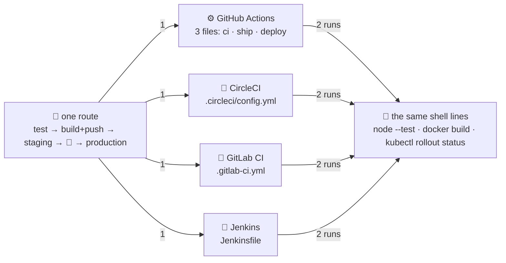

# 🗣️ Lesson 11 — The same pipeline in four dialects: four couriers, one route

**📍 You are here:** Lesson **11** of 12 · Previous: `lesson-10-deploy-to-kubernetes` · Next: `lesson-12-pipeline-hygiene`

---

## 📦 What's in this branch

Lessons 01–10, **plus** the phrasebook. Nothing new happens in this lesson —
the same route (test → build & push → staging → signature → production) is
written four times, and you learn to read all four. Real files:

- [.github/workflows/ci.yml](../../.github/workflows/ci.yml) · [ship.yml](../../.github/workflows/ship.yml) · [deploy.yml](../../.github/workflows/deploy.yml) — GitHub Actions splits the route into three files
- [.circleci/config.yml](../../.circleci/config.yml) — CircleCI: one file, `jobs:` wired together in `workflows:`
- [.gitlab-ci.yml](../../.gitlab-ci.yml) — GitLab CI: one file, `stages:` and YAML anchors
- [Jenkinsfile](../../Jenkinsfile) — Jenkins declarative pipeline, in Groovy rather than YAML
- [app/package.json](../../app/package.json) — `test:ci` is where the logic can live so the YAML stays thin

## 🧒 Explain like I'm 5

Four courier companies bid for the school's route 📮. Each one drives the
same road: pick up the homework, check it, photocopy it, file it in the
locker, deliver to the practice board, wait for the principal's signature,
deliver to the main board.

But each company has its **own paperwork** 📄. One calls a stop a "job", one a
"stage". One calls its driver a "runner", one an "agent", one an "executor".
Three write their forms in YAML; one writes them in Groovy. The route does not
change; the words on the form do.

So this lesson is a **phrasebook** 🗣️. Learn the fourteen words that matter
and any of the four forms reads like the one you already know. The best part:
the actual *work* — `node --test`, `docker build`, `kubectl rollout status` —
is the same shell command in all four files. The dialect is only the wrapper.

## 🗺️ Diagram



## ❓ What

### 🧠 The Rosetta stone — the words as the four real files spell them

| concept | ⚙️ GitHub Actions | 🔄 CircleCI | 🦊 GitLab CI | 🎩 Jenkins |
|---|---|---|---|---|
| trigger | `on: push:` / `pull_request:` / `workflow_call:` / `workflow_dispatch:` | implicit: a push runs `workflows:` | implicit: a push runs the pipeline | set on the job (webhook / multibranch scan), not in the file |
| workflow / pipeline | one file = one workflow, `name: ✅ ci` | `workflows: test-build-deploy:` | the whole file; `stages: [test, build, deploy]` | `pipeline { … }` |
| job / stage | `jobs: test:` + `needs:` | `jobs: test:` + `requires:` | `test:` with `stage: test` + `needs:` | `stage('✅ test')` |
| step | `steps: - uses:` / `- run:` | `steps: - checkout` / `- run:` | `script:` lines | `steps { sh '…' }` |
| runner | `runs-on: ubuntu-latest` | `docker: - image: cimg/node:…` (executor) | `image: node:${NODE}-alpine` on a runner | `agent { docker { image "node:${NODE}-alpine" } }` / `agent any` |
| matrix | `strategy: matrix: node: [20, 22, 24]` | `matrix: parameters: node: […]` | `parallel: matrix: - NODE: […]` | `matrix { axes { axis { name 'NODE' … } } }` |
| cache | `actions/cache@v4`, `key: prepared-${{ hashFiles('app/prepare.js') }}` | `restore_cache` / `save_cache`, `{{ checksum "prepare.js" }}` | `cache: key: files: [app/prepare.js]` | none built in — persistent workspace, or the Job Cacher plugin |
| artifact | `actions/upload-artifact@v4` / `download-artifact@v4` | `store_artifacts` | `artifacts: paths:` + `expire_in` | not used in this file (`archiveArtifacts` is the step) |
| test report | the JUnit file uploaded as an artifact | `store_test_results` | `artifacts: reports: junit:` | `post { always { junit '…' } }` |
| secret / credential | `${{ secrets.X }}` / `${{ vars.X }}` | `context: school-cicd` | project CI/CD variables, `$AWS_ROLE_ARN` | `withAWS(credentials: 'aws-school-cicd', …)` |
| OIDC badge | `permissions: id-token: write` + `configure-aws-credentials` `role-to-assume:` | `aws-cli/setup: role_arn:` | `id_tokens:` + `aws sts assume-role-with-web-identity` | not in this file — a credential binding stands in |
| approval gate | `environment: production` + required reviewers | `hold-for-approval: type: approval` | `when: manual` | `input message: 'Deploy to production?'` |
| environment | `environment: staging` | a job `name:` + a `namespace:` parameter | `environment: { name: staging }` | `deployTo('staging')` — a function argument |
| only on main | `on: push: branches: [main]` | `filters: branches: only: main` | `rules: - if: $CI_COMMIT_BRANCH == $CI_DEFAULT_BRANCH` | `when { branch 'main' }` |

- **Hosted runner** = the vendor's machine, fresh for each job, drawn from an
  allowance. **Self-hosted runner / agent** = your machine or pod: your
  patching, your network reach, your bill. All four support self-hosted;
  Jenkins is self-hosted by nature.

## 🤔 Why

Teams change CI vendors more often than they change languages, and job ads
name all four. If your pipeline's *logic* lives in the YAML, a migration is a
rewrite; if it lives in scripts and `package.json`, the migration is a
translation of the thin wrapper — which is exactly the table above. This
course's [four-tab page](https://baluraut.github.io/learn-cicd-school/pipelines.html)
shows the complete files side by side.

### Where each shines (hedged — all four keep changing)

- ⚙️ **GitHub Actions**: lives where the code already is; a large marketplace
  of actions; public repositories get a free allowance at the time of writing.
- 🔄 **CircleCI**: fast executors, reusable **orbs**, **contexts** that scope
  credentials to named jobs, `setup_remote_docker` for image builds.
- 🦊 **GitLab CI**: SCM and CI in one product; **environments** and merge-request
  widgets (the JUnit report shows up in the MR); straightforward to self-manage.
- 🎩 **Jenkins**: self-hosted, a plugin for nearly everything, still common in
  large or long-lived estates; you carry the controller and its upgrades.

Each vendor has a free allowance that changes; check the current page, not
this README.

## 🔧 How (in this repo)

The one line all four agree on — the same test command, four wrappers:

```yaml
# .github/workflows/ci.yml
      - name: 🧪 test
        run: >
          node --test
          --test-reporter=spec  --test-reporter-destination=stdout
          --test-reporter=junit --test-reporter-destination=test-results.xml
```

```yaml
# .circleci/config.yml
      - run:
          name: 🧪 test
          command: |
            mkdir -p test-results
            node --test --test-reporter=spec --test-reporter-destination=stdout \
                        --test-reporter=junit --test-reporter-destination=test-results/junit.xml
```

```yaml
# .gitlab-ci.yml
  script:
    - cd app
    - node prepare.js                         # prints "already exists" on a cache hit
    - node --test --test-reporter=spec --test-reporter-destination=stdout
                  --test-reporter=junit --test-reporter-destination=test-results.xml
```

```groovy
// Jenkinsfile
                sh '''node --test --test-reporter=spec  --test-reporter-destination=stdout \
                                  --test-reporter=junit --test-reporter-destination=test-results.xml'''
```

**The migration tip.** [app/package.json](../../app/package.json) already has
`"test:ci": "node --test --test-reporter=spec … --test-reporter=junit …"`. Call
`npm run test:ci` from all four files and the reporter flags live in one place.
The same goes for the build-and-push shell and the deploy shell: put them in
`scripts/` and each dialect shrinks to "run this script with these credentials".

## 🧪 Try it

```bash
# 1) the three load-bearing commands, pulled out of all four dialects
for f in .github/workflows/ci.yml .github/workflows/ship.yml .github/workflows/deploy.yml \
         .circleci/config.yml .gitlab-ci.yml Jenkinsfile; do
  echo "── $f"; grep -nE "node --test|docker build|rollout status" "$f"
done

# 2) diff the deploy recipe between two dialects — only the variable spelling differs
recipe() { grep -hE "sed -i|kubectl apply|rollout status" "$1" | sed -E 's/^[ -]*//'; }
diff <(recipe .circleci/config.yml) <(recipe .gitlab-ci.yml)
diff <(recipe .gitlab-ci.yml) <(recipe Jenkinsfile)

# 3) count: how many dialects run each command? (GitHub's three files count as one dialect)
for c in "node --test" "docker build --build-arg APP_VERSION" "rollout status"; do
  n=0
  cat .github/workflows/*.yml | grep -qE "$c" && n=$((n+1))
  for f in .circleci/config.yml .gitlab-ci.yml Jenkinsfile; do grep -qE "$c" "$f" && n=$((n+1)); done
  echo "$c → $n of 4 dialects"
done

# 4) now the wrapper words: the matrix, four ways
grep -nE "matrix|axes|node: \[|NODE: \[" .github/workflows/ci.yml .circleci/config.yml .gitlab-ci.yml Jenkinsfile
```

### ⚠️ Common mistakes

- porting a pipeline by translating YAML line by line instead of moving the logic into scripts first — you carry every quirk across and gain nothing
- assuming the vocabulary maps one to one: a GitLab `stage` groups jobs that run in parallel, a Jenkins `stage` is one sequential block, and a CircleCI job is ordered only by `requires:`
- comparing vendors on last year's free allowance or a blog post — the allowances change; check the current page before choosing

## ⏭️ Next

You can read all four forms. The last lesson is the mailroom's rulebook
poster: what keeps a pipeline trustworthy for years, and the handoff to the
ArgoCD school.

```bash
git checkout lesson-12-pipeline-hygiene
```
