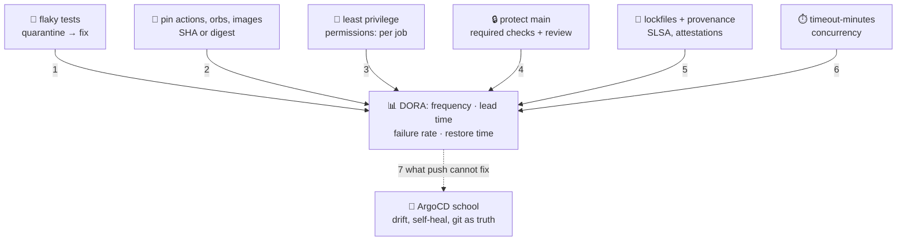

# 🧹 Lesson 12 — Pipeline hygiene & the handoff: the mailroom rulebook

**📍 You are here:** Lesson **12** of 12 — the final lesson! · Previous: `lesson-11-four-dialects`

> 🔗 **Next:** the ArgoCD school's lesson 01 starts exactly where this one ends.

---

## 📦 What's in this branch

All 12 lessons — the complete course. The finale is the poster on the mailroom
wall: the habits that keep the courier trustworthy after the novelty wears
off, an honest scoreboard, the one problem this whole course cannot solve, and
your graduation test. Real files: all of them — the hygiene lines already
present are called out below.

## 🧒 Explain like I'm 5

The courier robot works. Now the school writes the **rulebook poster** 🧹 so it
keeps working next year, when nobody remembers who set it up:

1. **A test that fails only on Tuesdays is not a test** 🎲 — quarantine it,
   fix it, do not just retry until it passes. Retries hide rot.
2. **Know exactly which tools you hired** 📌 — pin actions, orbs and base
   images to a fingerprint (a commit SHA or an image digest), so "v4" cannot
   quietly change under you.
3. **Give the robot the smallest key that works** 🪪 — `permissions:` per
   workflow and job, and no master keys (lesson 06).
4. **Lock the main board** 🔒 — nothing lands on `main` without a green check
   and a review; scan pushes for secrets before they land.
5. **Keep receipts** 🧾 — a lockfile says what went in; **build provenance**
   says who built it, from which commit, with which pipeline.
6. **Set a clock** ⏱️ — a job that hangs should fail; a newer push should
   cancel the older run.

And one scoreboard 📊 that is not a vanity metric: how often you deliver, how
long a change waits, how often a delivery breaks something, how fast you fix
it. Four numbers, honestly measured, beat any dashboard.

## 🗺️ Diagram



## ❓ What

- **Flaky test** = passes and fails on the same commit. Quarantine it (skip
  with a ticket), fix the cause (timing, shared state, network), then un-skip.
  Auto-retries make the number look better and the problem invisible.
- **Pinning** = referencing a dependency by something that cannot move: a full
  commit SHA for an action, an exact `x.y.z` for an orb, a `sha256:` digest for
  an image. Dependabot or Renovate then bump the pin with a diff you review.
- **Least privilege** = `permissions:` at the top of each workflow (read-only
  by default) and `id-token: write` only where the badge is needed.
- **Branch protection** = `main` accepts merges only with required status
  checks green and a review. **Secret scanning** with **push protection**
  blocks a push that contains a known credential shape before it lands
  (availability depends on the plan and on whether the repo is public).
- **Lockfile** = the exact dependency tree that went into the build (this app
  has none because it has no dependencies). **Build provenance** = a signed
  statement of *how* an artifact was built; **SLSA** defines levels for how
  strong that statement is; `actions/attest-build-provenance` produces one.
- **`timeout-minutes` / `concurrency`** = a ceiling on how long a job may
  hang, and a rule that a newer run replaces an older one.

### 🧠 The scoreboard — DORA's four metrics

| metric | asks | this course's lever |
|---|---|---|
| deployment frequency | how often does the van reach production? | small changes, a boring pipeline |
| lead time for changes | commit → running in production: how long? | fast CI (L04), automated deploy (L10) |
| change failure rate | what share of deliveries need a fix or a rollback? | tests on the BOX (L07), staging first (L08), probes (L09) |
| time to restore service | when it breaks, how long until it works again? | redeploy yesterday's tag (L09) |

No target numbers here on purpose: what counts as good depends on the team,
and the published research reports ranges that shift from year to year.
Measure your own four and watch the trend.

## 🤔 Why

A pipeline is long-lived software that other people trust blindly. An unpinned
action, a flaky test everyone re-runs, a token with write access it never uses
— each is fine on day one and a quiet liability on day four hundred. The Docker
school's [L08](https://baluraut.github.io/learn-docker-school/lesson-diagrams.html#l08)
makes the same argument for image tags, and the AWS school's
[L06](https://baluraut.github.io/learn-aws-school/lesson-diagrams.html#l06) for IAM.

**What the rulebook cannot fix.** After the van drives away, nothing in this
course watches the board. A `kubectl edit` by hand, a `rollout undo` in a
hurry, a Deployment scaled by a well-meaning teacher — the pipeline's last run
still says ✅. That gap has a name, **drift**, and its fix lives inside the
cluster rather than in the mailroom. That is the ArgoCD school:
[L04](https://baluraut.github.io/learn-argocd-school/lesson-diagrams.html#l04)
counts the gaps, [L05](https://baluraut.github.io/learn-argocd-school/lesson-diagrams.html#l05)
introduces git as the single source of truth and an agent that pulls and self-heals.

## 🔧 How (in this repo)

Already on the poster — [ci.yml](../../.github/workflows/ci.yml):

```yaml
permissions:
  contents: read            # lesson 06: the job's own token gets the least it needs

concurrency:                # a newer push cancels the older run of the same branch
  group: ci-${{ github.ref }}
  cancel-in-progress: true
```

The [Jenkinsfile](../../Jenkinsfile) spells the clock its own way:

```groovy
  options { timestamps(); disableConcurrentBuilds() }
```
```groovy
      options { timeout(time: 2, unit: 'DAYS') }
```

Not yet on the poster — this course keeps `@v4` major tags so the files stay
readable; a production repo pins and lets a bot bump the pins:

```yaml
# illustrative — pinned and time-boxed
jobs:
  test:
    timeout-minutes: 10                                   # a hung job fails instead of waiting for hours
    steps:
      - uses: actions/checkout@<full-40-char-sha>         # v4.x — Dependabot/Renovate bump the pin
```

```yaml
# illustrative — the same idea for an image, an orb, and a provenance statement
FROM node:22-alpine@sha256:<digest>
orbs: { aws-cli: circleci/aws-cli@5.1.<patch> }           # full x.y.z, not a floating 5.1
- uses: actions/attest-build-provenance@<pinned>          # after the image push; needs attestations: write
```

Branch protection and secret scanning are repository settings, not files:
in your fork, Settings → Branches (or Rules) adds a rule for `main` that
requires a pull request and the `test (node 20|22|24)` checks; Settings → Code
security turns on secret scanning and push protection. Menu names move; the
idea does not.

## 🧪 Try it

```bash
# 1) how pinned are we? list the floating references in the four dialects
grep -nE "uses: .*@v[0-9]" .github/workflows/*.yml                  # major tags — readable, not pinned
grep -nE "image: cimg|aws-cli@|^FROM " .circleci/config.yml app/Dockerfile   # image tags and an orb, no digest

# 2) resolve one digest so you know what a pin looks like (needs Docker)
docker pull node:22-alpine >/dev/null && docker inspect --format '{{index .RepoDigests 0}}' node:22-alpine

# 3) the flaky-test drill: run the suite 10 times; one ❌ means quarantine + fix, not retry
for i in $(seq 1 10); do (cd app && node --test >/dev/null 2>&1) && printf ✅ || printf ❌; done; echo

# 4) a rough deployment-frequency baseline from your fork's run history
gh run list --workflow=ship.yml --limit=20 --json conclusion,createdAt,updatedAt
```

### ⚠️ Common mistakes

- adding a retry count to a flaky job and moving on — the failure rate did not drop, it went dark
- pinning `actions/checkout` to a SHA but leaving `node:22-alpine`, `cimg/aws:2024.03` and the orb floating — a pin is only as good as the loosest one
- treating a green pipeline as proof the cluster matches git — it proves the last van trip succeeded; what happened at the board since is the ArgoCD school's problem

### 🎓 Graduation test — can you explain this?

> *A developer opens a pull request. CI runs the tests on Node 20, 22 and 24
> and uploads a JUnit report. After the merge to `main`, the pipeline builds an
> image, smoke-tests the container, pushes it to ECR tagged with the full
> commit SHA, deploys it to `staging`, waits for the rollout, and holds until a
> reviewer approves `production`.*

1. Which event started the first run, and which the second?
2. What decides whether the cache step is a hit or a miss?
3. What travels between the build job and the push job, and why is it not a cache?
4. How does the push job get AWS credentials without a stored key?
5. What is the image tag, and why that and not `latest`?
6. What is `APP_VERSION` set to, and where can you read it back?
7. Which line, plus which repository setting, turns `production` into an approval gate?
8. What makes the rolling update pause if the new pod is broken?
9. What are the two ways to roll back, and which one should you reach for first?
10. After a successful production job, what does the pipeline know about the cluster an hour later?

If every answer comes out in one sentence, you are done with this school.

## 🎓 The series — where you are now

**You have finished stop 3️⃣ of the Ops track.** One stop remains:

- 0️⃣ ☁️ [Learn AWS School](https://baluraut.github.io/learn-aws-school/) — the account, IAM, badges for robots
- 1️⃣ 🍱 [Learn Docker School](https://baluraut.github.io/learn-docker-school/) — packs the lunchbox and files it in ECR
- 2️⃣ ☸️ [Learn Kubernetes School](https://baluraut.github.io/learn-kubernetes-school/) — runs it: pods, Services, probes, rollouts
- 3️⃣ 📮 **Learn CI/CD School — this course** — checks it, copies it, delivers it
- 4️⃣ 🤖 [Learn ArgoCD School](https://baluraut.github.io/learn-argocd-school/) — keeps the cluster honest afterwards: git as truth, self-heal, no more drift

Check it. Copy it. Deliver it. Then let git keep it that way. 📮🚚🤖

```bash
git checkout main
```
